# 1. الغلاف

**منصة إدارة الامتثال والحوكمة الحكومية**

# دليل المستخدم
## برنامج قياس

 

| | |
|---|---|
| **النظام** | منصة إدارة الامتثال والحوكمة الحكومية |
| **البرنامج** | قياس |
| **نوع الوثيقة** | دليل مستخدم |
| **اللغة** | العربية |
| **المؤلف** | Nasser |
| **تاريخ الإصدار** | 2026-07-18 |

---

# 2. بيانات الوثيقة

| الحقل | القيمة |
|---|---|
| اسم الوثيقة | دليل المستخدم — برنامج قياس |
| النظام | منصة إدارة الامتثال والحوكمة الحكومية |
| البرنامج الموثَّق | قياس (Qiyas) — حصرًا. لا يتناول هذا الدليل برامج سمود أو ECC أو NDMO أو أي محرك امتثال آخر على المنصة. |
| المؤلف / مالك الوثيقة | Nasser |
| نوع الوثيقة | دليل مستخدم نهائي (End-User Guide) |
| اللغة | العربية، بتنسيق من اليمين إلى اليسار (RTL) |
| الجمهور المستهدف | جميع مستخدمي برنامج قياس بأدوارهم المختلفة (انظر القسم 8) |
| حالة الوثيقة | انظر تصنيف الجاهزية النهائي في تقرير التحقق `verification-report.md` |
| مصدر المحتوى | استخدام فعلي مباشر للنسخة العاملة من المنصة في بيئة توثيق معزولة، مع التحقق من الكود عند الحاجة لفهم سلوك غير ظاهر بالواجهة |
| بيانات اللقطات | بيانات اصطناعية محايدة بالكامل (انظر القسم 12) — لا توجد أي بيانات إنتاجية أو أسماء حقيقية |

---

# 3. سجل الإصدارات

| الإصدار | التاريخ | الوصف | المُعِدّ | الحالة |
|---|---|---|---|---|
| 0.1 | 2026-07-18 | إصدار أولي كامل بعد التحليل والتحقق الفعلي من التطبيق العامل | Nasser | مسودة — بانتظار مراجعة مالك العمل |

> لا يحمل هذا الإصدار أي اعتماد أو توقيع من مراجع عمل. الحقول الخاصة بالمراجعة والاعتماد النهائي متروكة فارغة عمدًا إلى حين إجراء مراجعة فعلية من مالك العمل (انظر القسم 3 من تقرير التحقق `verification-report.md`).

| دور المراجعة | الاسم | التاريخ | القرار |
|---|---|---|---|
| مراجعة مالك العمل | — (بانتظار التعيين) | — | — |
| اعتماد نهائي للتوزيع | — (بانتظار التعيين) | — | — |

---

# 4. جدول المحتويات

1. الغلاف
2. بيانات الوثيقة
3. سجل الإصدارات
4. جدول المحتويات
5. مقدمة عن برنامج قياس
6. أهداف الدليل ونطاقه
7. الجمهور المستهدف وطريقة استخدام هذا الدليل
8. الأدوار في برنامج قياس (نظرة عامة)
9. نظرة عامة على سير عمل قياس الكامل
10. المصطلحات والاختصارات الأساسية
11. متطلبات الوصول للنظام
12. بدء الاستخدام
13. مفتاح الرموز المستخدمة في هذا الدليل
14. تسجيل الدخول
15. اختيار برنامج قياس
16. لوحة التحكم الرئيسية
17. قائمة التنقل والعناصر المشتركة
18. دليل مدير برنامج قياس
19. دليل مدير الإدارة
20. دليل المدقق
21. دليل الموظف
22. دليل المشاهد التنفيذي
23. دليل المسؤول العام (وظائف قياس فقط)
24. الإشعارات
25. طلبات التمديد
26. المسودات والإرسال
27. الرفض وإعادة الإرسال
28. التقارير
29. استيراد وتصدير Excel
30. دليل الحالات
31. قاموس الحقول والأزرار
32. رسائل التحقق والأخطاء الشائعة
33. الأسئلة الشائعة
34. اعتبارات إمكانية الوصول
35. جدول الصلاحيات المختصر

---

# 5. مقدمة عن برنامج قياس

**قياس** هو أحد برامج الامتثال المُدارة عبر منصة إدارة الامتثال والحوكمة الحكومية، ويُعنى بمتابعة مدى التزام الجهة الحكومية بمتطلبات تجريبية محددة عبر دورات تقييم دورية (سنوية أو حسب ما يُحدَّد). يقوم البرنامج على تقسيم المتطلبات (المعايير) وإسنادها إلى الإدارات المعنية، ثم متابعة رفع الإدارات لأدلة الإثبات، ومرورها بسلسلة مراجعات متتالية (مدير الإدارة ← المدقق ← الاعتماد النهائي من مدير البرنامج) قبل اعتمادها بشكل نهائي.

يتيح البرنامج لكل دور من أدواره لوحة عمل مخصصة تعرض له فقط ما يخصه من مهام وصلاحيات، مع سجل زمني كامل لكل قرار، وإشعارات فورية عند كل انتقال في حالة المتطلب.

هذا الدليل يوثّق برنامج قياس **حصرًا**، بصفته سير العمل الفعلي والمقصود لهذا البرنامج على المنصة، والمُطابق تمامًا لوصف سير العمل المُعتمد (انظر القسم 9).

> **ملاحظة توثيقية مهمة**: يحتوي التطبيق كذلك على مسارات ونماذج شاشات قديمة (مثل `/documents` و`/auditor` بصيغتهما القديمة) بقيت لأغراض التوافق العكسي مع روابط سابقة، ولا تُستخدم حاليًا في سير عمل قياس الفعلي. لم تُوثَّق هذه الشاشات القديمة في هذا الدليل لأنها ليست جزءًا من سير العمل الحالي المقصود، وقد وُثِّق وجودها كملاحظة غير معيقة في تقرير التحقق.

---

# 6. أهداف الدليل ونطاقه

**أهداف هذا الدليل:**

- تمكين كل مستخدم لبرنامج قياس من فهم دوره ومسؤولياته وصلاحياته بدقة.
- شرح سير العمل الكامل والمُتحقَّق منه فعليًا، خطوة بخطوة، بأسماء الأزرار والحقول والحالات الحقيقية كما تظهر في التطبيق.
- توثيق كل نتيجة متوقعة، وكل تنبيه أو إشعار يصدر عن كل إجراء.
- توضيح رسائل الأخطاء الشائعة وكيفية التعامل معها.

**نطاق هذا الدليل:**

- برنامج **قياس** فقط، ضمن سير العمل الحالي (Phase 2) الموصوف في القسم 9.
- لا يشمل هذا الدليل: برامج سمود أو ECC أو NDMO، أو معايير ISO 27001/22301 أو COBIT، أو أي تفاصيل تقنية/برمجية للمطورين، أو إعدادات البنية التحتية.
- لا يشمل هذا الدليل شاشات المسار القديم (Phase 1) غير المستخدمة فعليًا في سير عمل قياس الحالي.

---

# 7. الجمهور المستهدف وطريقة استخدام هذا الدليل

هذا الدليل موجَّه لجميع مستخدمي برنامج قياس، أيًا كان دورهم: مديرو البرنامج، مديرو الإدارات، المدققون، الموظفون، المشاهدون التنفيذيون، وكذلك المسؤول العام للمنصة فيما يخص وظائفه ضمن قياس تحديدًا.

**كيفية الاستخدام:**

- إن كنت مستخدمًا جديدًا، ابدأ بالقسم 8 (الأدوار) والقسم 9 (سير العمل) لفهم الصورة الكاملة، ثم انتقل مباشرة إلى الفصل المخصص لدورك (الأقسام 18–23).
- إن كنت تبحث عن معنى حالة معينة، راجع القسم 30 (دليل الحالات).
- إن كنت تبحث عن معنى زر أو حقل معين، راجع القسم 31 (قاموس الحقول والأزرار).
- إن واجهت رسالة خطأ، راجع القسم 32.
- لأسئلة عامة متكررة، راجع القسم 33.

---

# 8. الأدوار في برنامج قياس (نظرة عامة)

تم التحقق من الأدوار التالية فعليًا من خلال صلاحيات النظام وقوائم التنقل الفعلية، وليس من مجرد أسماء افتراضية:

| الدور | الوصف المختصر | القسم المخصص |
|---|---|---|
| **مدير برنامج قياس** | يدير دورات التقييم، يُسند المعايير للإدارات، يعتمد المتطلبات اعتمادًا نهائيًا، يضبط إعدادات SLA. | القسم 18 |
| **مدير الإدارة** | يراجع الطلبات المُرسَلة من موظفي إدارته (موافقة أو رفض) قبل تحويلها للمدقق. | القسم 19 |
| **المدقق** | يراجع الطلبات على مستوى البرنامج بالكامل بعد موافقة مدير الإدارة، ويبتّ في طلبات التمديد. | القسم 20 |
| **الموظف** | يرفع أدلة الإثبات على المتطلبات المُسندة لإدارته، ويرسلها للمراجعة، ويطلب التمديد عند الحاجة. | القسم 21 |
| **المشاهد التنفيذي** | يطّلع على لوحة تنفيذية عامة للمنصة دون أي صلاحية تعديل. | القسم 22 |
| **المسؤول العام (Super Admin)** | يملك صلاحية كاملة على مستوى المنصة، بما يشمل وظائف قياس، بالإضافة إلى وظائف عامة خارج نطاق أي برنامج بعينه (لا يشرحها هذا الدليل إلا فيما يخص قياس). | القسم 23 |

**مستخدم متعدد الأدوار**: من الممكن تقنيًا أن يحمل المستخدم الواحد أكثر من دور برنامج ضمن قياس في آن واحد (مثال: مدير إدارة ومدقق معًا). في هذه الحالة، تُطبَّق صلاحيات كل دور من أدواره على حدة دون تعارض بينها — أي أن المستخدم يستطيع تنفيذ كل ما يسمح به أي دور من أدواره. لمزيد من التفصيل، راجع ورقة «مفتاح الرموز» في `role-permission-matrix.xlsx`.

---

# 9. نظرة عامة على سير عمل قياس الكامل

تم التحقق من سير العمل التالي مباشرة من التطبيق العامل (وليس افتراضًا)، وهو يطابق تمامًا سير العمل المتوقع لبرنامج قياس:

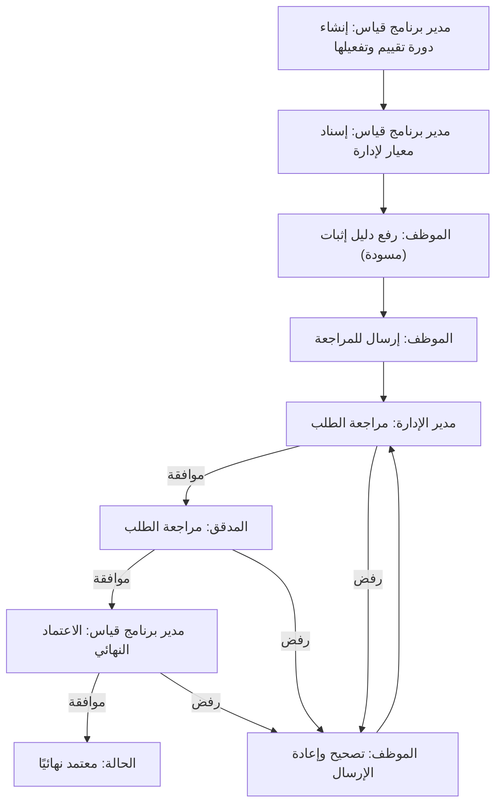
```mermaid
flowchart TD
    A["مدير برنامج قياس: إنشاء دورة تقييم وتفعيلها"] --> B["مدير برنامج قياس: إسناد معيار لإدارة"]
    B --> C["الموظف: رفع دليل إثبات (مسودة)"]
    C --> D["الموظف: إرسال للمراجعة"]
    D --> E["مدير الإدارة: مراجعة الطلب"]
    E -- موافقة --> F["المدقق: مراجعة الطلب"]
    E -- رفض --> G["الموظف: تصحيح وإعادة الإرسال"]
    F -- موافقة --> H["مدير برنامج قياس: الاعتماد النهائي"]
    F -- رفض --> G
    H -- موافقة --> I["الحالة: معتمد نهائيًا"]
    H -- رفض --> G
    G --> E
```

**القاعدتان الثابتتان في كل مسار رفض (تم التحقق منهما فعليًا من الكود وسلوك التطبيق):**

1. **أي رفض، من أي مرحلة كانت** (مدير الإدارة، المدقق، أو الاعتماد النهائي)، **يُعيد الطلب دائمًا إلى الموظف** بحالة «معاد للتعديل»، وليس إلى المرحلة التي سبقت الرافض.
2. **إعادة الإرسال بعد التصحيح تبدأ دائمًا من مدير الإدارة من جديد**، بصرف النظر عن المرحلة التي رفضت الطلب أصلًا. أي أن رفض المدقق أو رفض الاعتماد النهائي لا يُعيد الطلب مباشرة إلى نفس تلك المرحلة، بل يُمرَّر عبر مراجعة مدير الإدارة من جديد.

**مسار إضافي مستقل: طلب التمديد** — يمكن للموظف طلب تمديد الموعد النهائي لمتطلب معيّن في أي وقت (قبل الاعتماد النهائي)، ويُبتّ في هذا الطلب بشكل مستقل عن مسار المراجعة الأساسي (راجع القسم 25).

---

# 10. المصطلحات والاختصارات الأساسية

| المصطلح | المعنى |
|---|---|
| **دورة التقييم** | فترة زمنية محددة (Cycle) تُجمَّع ضمنها المعايير والمتطلبات التي سيتم تقييمها. |
| **المعيار / المتطلب** | البند التفصيلي المطلوب من الإدارة تقديم دليل إثبات عليه. |
| **الإسناد (Assignment)** | ربط معيار معيّن بإدارة معينة ضمن دورة تقييم. |
| **دليل الإثبات (Evidence)** | الملف الذي يرفعه الموظف إثباتًا لتنفيذ المتطلب. |
| **الطلب / التقديم (Submission)** | نسخة من دليل الإثبات المُرسلة للمراجعة، ولها حالة مستقلة عن حالة الإسناد. |
| **SLA** | المهلة الزمنية المستهدفة لكل مرحلة مراجعة. |
| **مسند إليّ** | المعايير التي أُسندت مباشرة إلى المستخدم أو إلى إدارته. |

---

# 11. متطلبات الوصول للنظام

- حساب مستخدم نشط على المنصة، ببيانات اعتماد صادرة من الجهة المسؤولة داخل مؤسستك.
- متصفح ويب حديث. تعرض المنصة الواجهة باللغة العربية باتجاه من اليمين إلى اليسار (RTL) بشكل افتراضي، مع إمكانية التبديل للإنجليزية عبر زر «Switch to English» أعلى الصفحة.
- لا تتطلب المنصة تثبيت أي برنامج إضافي؛ الوصول بالكامل عبر المتصفح.

---

# 12. بدء الاستخدام

عند استلامك بيانات الدخول لأول مرة، افتح رابط المنصة في المتصفح، وستصل إلى صفحة تسجيل الدخول الموضحة في القسم 14. إن طُلب منك تغيير كلمة المرور عند أول دخول، ستُوجَّه تلقائيًا لصفحة تغيير كلمة المرور قبل إتاحة الوصول لبقية النظام.

> **ملاحظة حول بيانات هذا الدليل**: جميع الحسابات والأسماء والبيانات الظاهرة في لقطات الشاشة ضمن هذا الدليل **اصطناعية بالكامل** (مثال: «مدير برنامج قياس التجريبي»، «الإدارة التجريبية»، «دورة قياس التجريبية 2026»، معايير برمز `QIYAS-TEST-00X`)، وتم إنشاؤها في بيئة توثيق معزولة خصيصًا لأغراض هذا الدليل. لا تحتوي أي لقطة شاشة على اسم موظف حقيقي أو بريد إلكتروني حقيقي أو أي بيانات إنتاجية.

---

# 13. مفتاح الرموز المستخدمة في هذا الدليل

- تُرقَّم الأشكال (لقطات الشاشة) تسلسليًا بصيغة **«شكل N: الوصف»** أسفل كل صورة.
- كل إجراء موثّق يتبع نموذجًا ثابتًا من الحقول: **اسم الإجراء، الدور المسموح له، الهدف، المتطلبات المسبقة، خطوات التنفيذ، النتيجة المتوقعة، الحالة التالية، التنبيه، ملاحظات، الأخطاء المحتملة، الصور المرتبطة.**
- شارات الحالة الملونة في التطبيق (مثل «نشطة»، «معتمد»، «معاد للتعديل») تُذكر بنصها الحرفي كما تظهر في الواجهة، دون ترجمة أو إعادة صياغة.

---

# 14. تسجيل الدخول

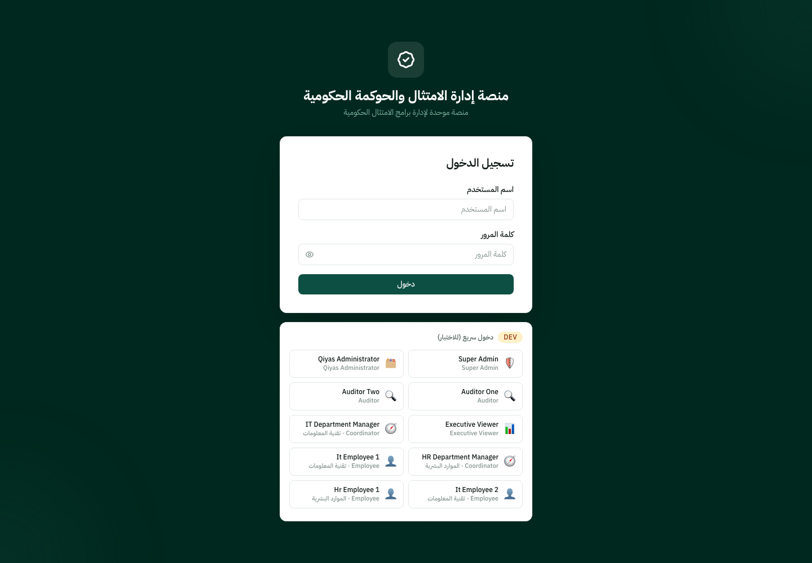

**شكل 1: صفحة تسجيل الدخول**

### إجراء: تسجيل الدخول إلى المنصة

| الحقل | التفصيل |
|---|---|
| **اسم الإجراء** | تسجيل الدخول |
| **الدور المسموح له** | جميع الأدوار |
| **الهدف** | الوصول إلى حساب المستخدم على المنصة |
| **المتطلبات المسبقة** | حساب نشط، واسم مستخدم وكلمة مرور صحيحان |
| **خطوات التنفيذ** | 1) افتح رابط المنصة. 2) أدخل اسم المستخدم في حقل اسم المستخدم. 3) أدخل كلمة المرور. 4) اضغط زر الدخول. |
| **النتيجة المتوقعة** | الانتقال إلى شاشة اختيار البرنامج (القسم 15) |
| **الحالة التالية** | — |
| **التنبيه** | لا يوجد تنبيه نظامي مستقل؛ الانتقال الفوري لشاشة اختيار البرنامج هو التأكيد الوحيد |
| **ملاحظات** | إن كان الحساب مُلزَمًا بتغيير كلمة المرور، يُوجَّه المستخدم تلقائيًا لصفحة تغيير كلمة المرور قبل أي شاشة أخرى |
| **الأخطاء المحتملة** | بيانات اعتماد غير صحيحة — راجع القسم 32 |
| **الصور المرتبطة** | شكل 1 |

---

# 15. اختيار برنامج قياس

بعد تسجيل الدخول، تعرض المنصة شاشة اختيار البرنامج، وتظهر فيها بطاقة كل برنامج امتثال يملك المستخدم عضوية فعّالة فيه.

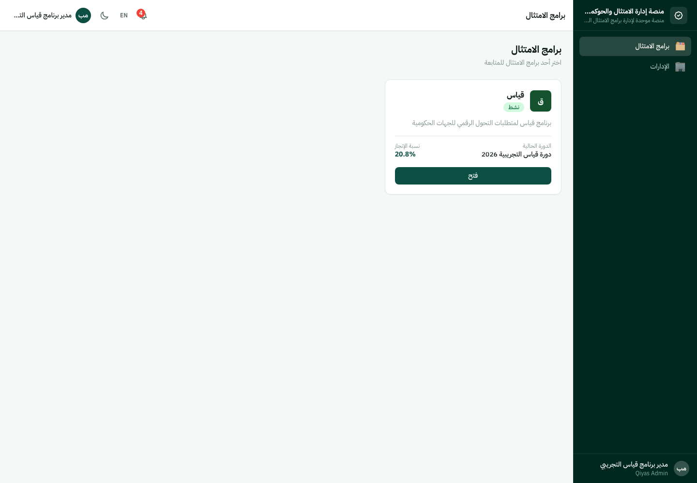

**شكل 2: شاشة اختيار البرنامج — تظهر بطاقة «قياس» بحالة «نشط»، مع اسم الدورة الحالية ونسبة الإنجاز الإجمالية للدورة**

### إجراء: فتح برنامج قياس

| الحقل | التفصيل |
|---|---|
| **اسم الإجراء** | فتح برنامج قياس |
| **الدور المسموح له** | جميع الأدوار الأعضاء في برنامج قياس |
| **الهدف** | الدخول إلى لوحة عمل قياس |
| **المتطلبات المسبقة** | عضوية فعّالة في برنامج قياس |
| **خطوات التنفيذ** | 1) في شاشة «برامج الامتثال»، حدد بطاقة «قياس». 2) اضغط زر «فتح» أسفل البطاقة، أو اضغط على البطاقة نفسها. |
| **النتيجة المتوقعة** | الانتقال إلى لوحة تحكم قياس (القسم 16) |
| **الحالة التالية** | — |
| **التنبيه** | لا يوجد |
| **ملاحظات** | تعرض البطاقة اسم الدورة الحالية النشطة ونسبة الإنجاز الإجمالية لها كمؤشر سريع، قبل الدخول للبرنامج |
| **الأخطاء المحتملة** | لا تظهر بطاقة قياس إن لم يكن للمستخدم عضوية فعّالة في البرنامج |
| **الصور المرتبطة** | شكل 2 |

---

# 16. لوحة التحكم الرئيسية

صفحة «لوحة التحكم» (`/programs/QIYAS/dashboard`) هي أول ما يراه المستخدم بعد فتح برنامج قياس، وهي صفحة موحّدة تتفرّع محتوياتها داخليًا حسب دور المستخدم:

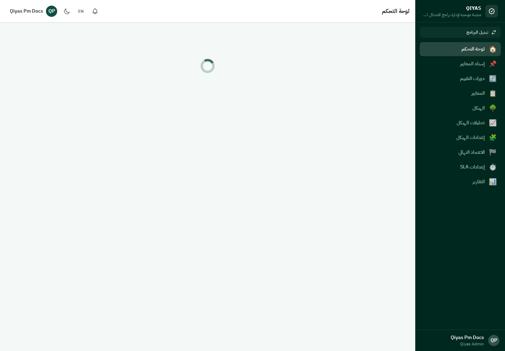

**شكل 3: لوحة التحكم — عرض مدير برنامج قياس**

| الدور | محتوى اللوحة |
|---|---|
| **المسؤول العام / المشاهد التنفيذي** | عرض تنفيذي شامل: الدورة الحالية، إحصاءات الحالة، تقدّم كل إدارة، النشاط الأخير |
| **المدقق** | عدد الطلبات بانتظار مراجعته، عدد المرفوض اليوم (المنسوب إليه شخصيًا)، طلبات التمديد المعلَّقة، المتأخر، المعتمد اليوم |
| **مدير الإدارة** | إحصاءات الحالة **ضمن إدارته فقط**، عدد المعايير والمتطلبات، آخر 5 وثائق لإدارته |
| **الموظف** | إحصاءاته الشخصية ضمن إدارته |
| **مدير برنامج قياس** | **⚠️ لا يوجد تفرّع مخصص له فعليًا** — انظر التنبيه أدناه |

> ### ⚠️ ملاحظة موثقة ومؤكَّدة: قصور في لوحة تحكم مدير برنامج قياس
>
> عند فتح لوحة التحكم بحساب مدير برنامج قياس، **لا تحتوي الصفحة على تفرّع مخصص لهذا الدور**؛ يقع مدير البرنامج ضمن نفس الحالة الافتراضية المستخدَمة لعرض شاشة الموظف. وبما أن مدير البرنامج لا يرتبط عادة بإدارة محددة، تظهر معظم البطاقات المرتبطة بالإدارة بقيمة صفر أو شبه صفرية، رغم وجود بيانات فعلية وكثيرة على مستوى البرنامج.
>
> **هذا سلوك حقيقي مؤكَّد من فحص الكود المصدري مباشرة، وليس خطأ في التقاط لقطات هذا الدليل.** لا يعتمد مدير برنامج قياس على هذه اللوحة بالذات لمتابعة عمله؛ بل يستخدم الشاشات الوظيفية الفعلية الموثّقة في القسم 18 (دورات التقييم، إسناد المعايير، الاعتماد النهائي، التقارير) كمصدر معلومات عملي وموثوق.

---

# 17. قائمة التنقل والعناصر المشتركة

يوجد في يمين الشاشة (أو يسارها حسب اتجاه اللغة) شريط تنقّل جانبي يعرض روابط الصفحات المتاحة، وتختلف الروابط الظاهرة حسب دور المستخدم. من العناصر المشتركة أعلى الصفحة لجميع الأدوار:

| العنصر | الوظيفة |
|---|---|
| 🗂️ برامج الامتثال | العودة لشاشة اختيار البرنامج |
| 🔔 أيقونة الإشعارات | فتح مركز الإشعارات (القسم 24)، مع شارة عدد غير المقروء |
| زر تبديل اللغة (Switch to English / التبديل للعربية) | تبديل لغة الواجهة |
| زر تبديل الوضع الداكن | تبديل مظهر الواجهة |
| بطاقة اسم المستخدم | تعرض الاسم والدور، وتفتح قائمة الوصول للملف الشخصي وتسجيل الخروج |

روابط شريط التنقّل الخاصة ببرنامج قياس (تظهر فقط للأدوار المصرَّح لها بكل رابط) موثّقة بالتفصيل ضمن فصل كل دور (الأقسام 18–23).

---

# 18. دليل مدير برنامج قياس

مدير برنامج قياس هو المسؤول عن إدارة دورات التقييم، وهيكلة المعايير، وإسنادها للإدارات، والاعتماد النهائي للمتطلبات، وضبط إعدادات SLA.

## 18.1 دورات التقييم

**شكل 4: قائمة دورات التقييم**

### إجراء: إنشاء دورة تقييم جديدة

| الحقل | التفصيل |
|---|---|
| **اسم الإجراء** | إنشاء دورة تقييم جديدة |
| **الدور المسموح له** | مدير برنامج قياس، المسؤول العام |
| **الهدف** | فتح دورة تقييم جديدة لتجميع معايير ومتطلبات هذا العام |
| **المتطلبات المسبقة** | لا يوجد مانع عمل |
| **خطوات التنفيذ** | 1) من قائمة «دورات التقييم»، اضغط زر «دورة جديدة». 2) في النموذج، أدخل اسم الدورة والسنة وتاريخ البداية وتاريخ النهاية. 3) اضغط زر الحفظ. |
| **النتيجة المتوقعة** | دورة جديدة تُضاف للقائمة بحالة «مسودة» |
| **الحالة التالية** | مسودة |
| **التنبيه** | رسالة تأكيد داخل الصفحة عند إغلاق النموذج بنجاح |
| **ملاحظات** | لا يمكن إسناد معايير على دورة بحالة «مسودة» — يجب تفعيلها أولًا |
| **الأخطاء المحتملة** | حقول ناقصة أو تاريخ نهاية أسبق من تاريخ البداية — راجع القسم 32 |
| **الصور المرتبطة** | شكل 5، شكل 6، شكل 7، شكل 8 |

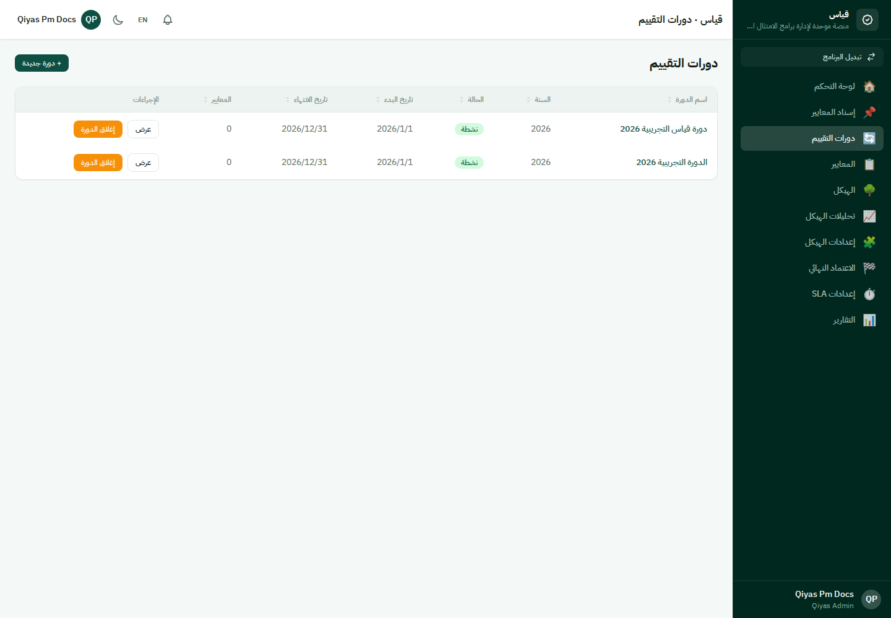

**شكل 5: زر «دورة جديدة»**

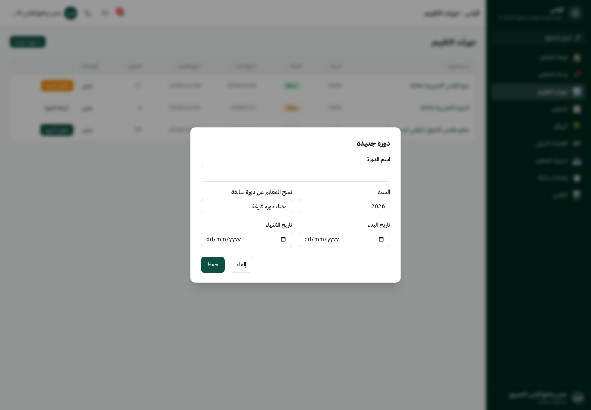

**شكل 6: نموذج إنشاء دورة جديدة، قبل تعبئة الحقول**

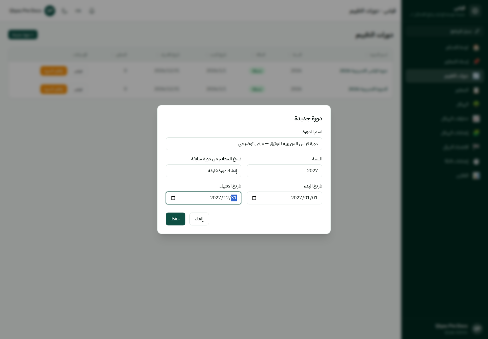

**شكل 7: نموذج إنشاء دورة تقييم بعد تعبئة الاسم والسنة والتواريخ**

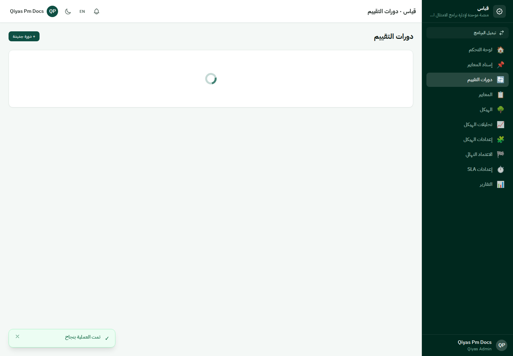

**شكل 8: القائمة بعد إنشاء الدورة الجديدة بنجاح**

### إجراء: تفعيل دورة تقييم

| الحقل | التفصيل |
|---|---|
| **اسم الإجراء** | تفعيل الدورة |
| **الدور المسموح له** | مدير برنامج قياس، المسؤول العام |
| **الهدف** | نقل الدورة من حالة «مسودة» إلى «نشطة» لتصبح جاهزة لإسناد المعايير |
| **المتطلبات المسبقة** | الدورة بحالة «مسودة» |
| **خطوات التنفيذ** | 1) من صف الدورة في القائمة، اضغط زر «تفعيل الدورة». |
| **النتيجة المتوقعة** | تتحول حالة الدورة إلى «نشطة» |
| **الحالة التالية** | نشطة |
| **التنبيه** | لم يُرصد نص تنبيه مخصص مستقل بخلاف تحديث الحالة في الصف مباشرة |
| **ملاحظات** | — |
| **الأخطاء المحتملة** | لا يظهر الزر إن كانت الدورة بحالة أخرى غير «مسودة» |
| **الصور المرتبطة** | شكل 9 |

**شكل 9: دورة التقييم بحالة «نشطة» بعد التفعيل**

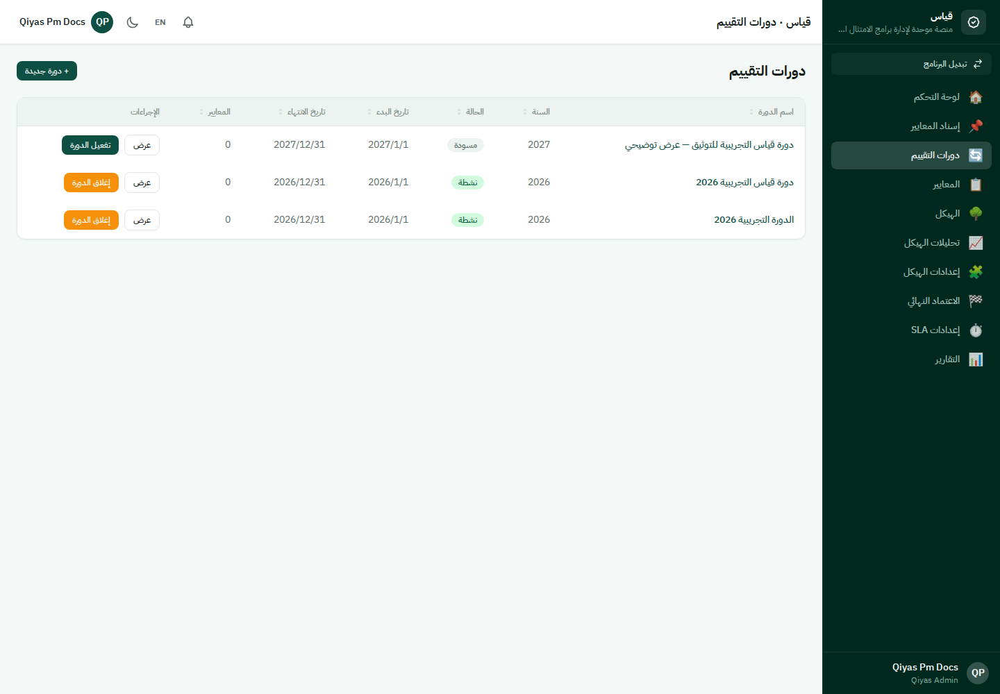

### إجراء: إغلاق دورة تقييم / أرشفتها

| الحقل | التفصيل |
|---|---|
| **اسم الإجراء** | إغلاق دورة تقييم |
| **الدور المسموح له** | مدير برنامج قياس، المسؤول العام |
| **الهدف** | إيقاف قبول أي إجراءات جديدة على الدورة بعد انتهاء فترة التقييم |
| **المتطلبات المسبقة** | الدورة بحالة «نشطة» |
| **خطوات التنفيذ** | 1) من صف الدورة، اضغط زر «إغلاق الدورة». |
| **النتيجة المتوقعة** | تتحول حالة الدورة إلى «مغلقة» |
| **الحالة التالية** | مغلقة (ويمكن لاحقًا أرشفتها عبر زر «أرشفة الدورة» فتصبح «مؤرشفة») |
| **التنبيه** | لا يوجد تنبيه مخصص مستقل |
| **ملاحظات** | لا يمكن إضافة معايير جديدة أو إسنادها على دورة مغلقة أو مؤرشفة |
| **الأخطاء المحتملة** | — |
| **الصور المرتبطة** | لا توجد لقطة منفصلة؛ الإجراء مطابق آليًا لإجراء التفعيل |

## 18.2 تفاصيل الدورة وإضافة معيار جديد

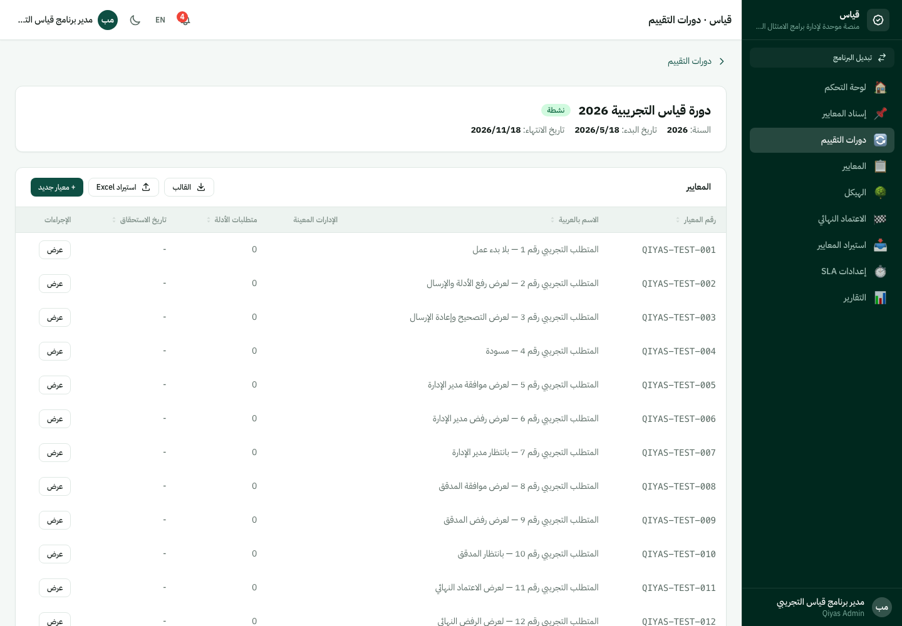

**شكل 10: تفاصيل الدورة — قائمة المعايير المرتبطة بها**

### إجراء: إضافة معيار جديد ضمن دورة

| الحقل | التفصيل |
|---|---|
| **اسم الإجراء** | إضافة معيار جديد |
| **الدور المسموح له** | مدير برنامج قياس، المسؤول العام |
| **الهدف** | تعريف متطلب/معيار جديد يمكن إسناده لاحقًا لإدارة |
| **المتطلبات المسبقة** | الدورة غير مغلقة ولا مؤرشفة |
| **خطوات التنفيذ** | 1) من تفاصيل الدورة، اضغط زر إضافة معيار. 2) أدخل رمز المعيار، والمنظور، والمحور، والاسم بالعربية. 3) اضغط زر الحفظ. |
| **النتيجة المتوقعة** | المعيار الجديد يظهر في قائمة معايير الدورة |
| **الحالة التالية** | غير مسند (حتى يُسند لإدارة — راجع 18.3) |
| **التنبيه** | إغلاق النموذج تلقائيًا والعودة لقائمة المعايير |
| **ملاحظات** | «المنظور» و«المحور» حقلان نصيّان حرّان يُستخدمان لتصنيف المعيار وتصفية التقارير لاحقًا |
| **الأخطاء المحتملة** | رمز معيار مكرر ضمن نفس البرنامج، أو حقول إلزامية فارغة |
| **الصور المرتبطة** | شكل 11، شكل 12، شكل 13 |

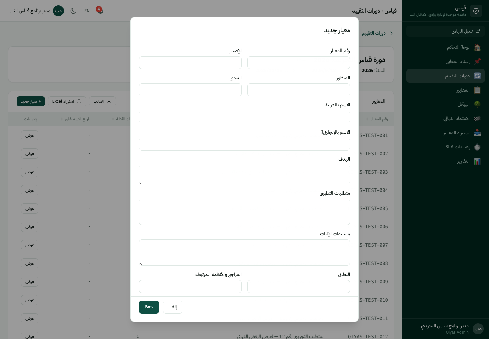

**شكل 11: نموذج إضافة معيار جديد، قبل التعبئة**

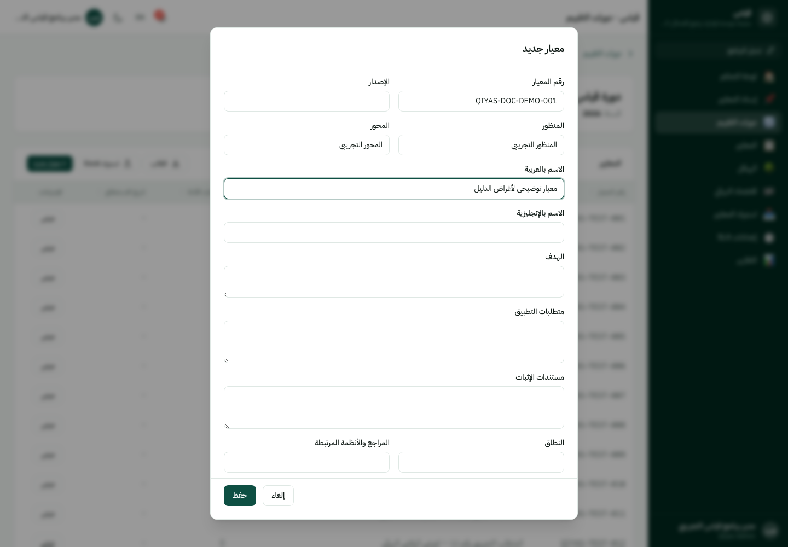

**شكل 12: نموذج إضافة معيار بعد تعبئة الرمز والمنظور والمحور والاسم**

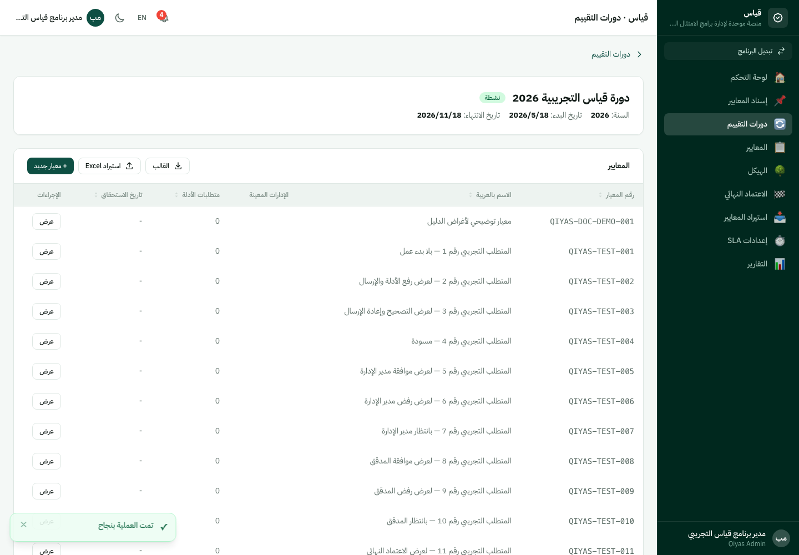

**شكل 13: قائمة المعايير بعد إضافة المعيار الجديد بنجاح**

> **ملاحظة**: يتوفر أيضًا مسار لاستيراد عدة معايير دفعة واحدة عبر ملف Excel من داخل تفاصيل الدورة (مسار قديم)، بالإضافة إلى مسار الاستيراد الحديث الموثَّق بالتفصيل في القسم 29. لا تُشرح شاشة الاستيراد القديمة هذه بالتفصيل هنا لأنها خارج نطاق سير العمل الموثَّق في هذا الدليل.

## 18.3 إسناد المعايير للإدارات

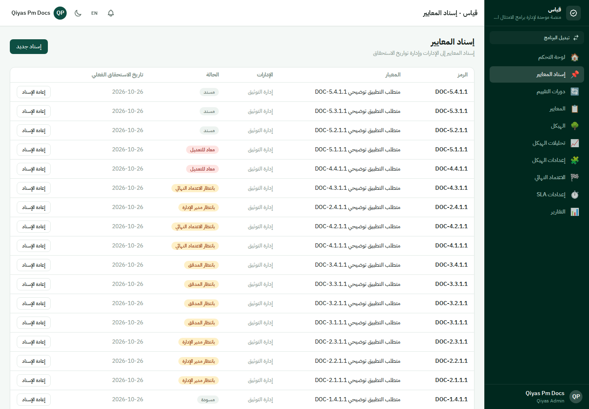

**شكل 14: قائمة إسناد المعايير**

### إجراء: إسناد معيار لإدارة

| الحقل | التفصيل |
|---|---|
| **اسم الإجراء** | إسناد |
| **الدور المسموح له** | مدير برنامج قياس، المسؤول العام |
| **الهدف** | تكليف إدارة معينة بمتابعة معيار محدد قبل موعد استحقاق معيّن |
| **المتطلبات المسبقة** | المعيار غير مُسند حاليًا بشكل نشط |
| **خطوات التنفيذ** | 1) من قائمة الإسناد، اضغط زر إسناد جديد. 2) اختر المعيار من القائمة. 3) اختر الإدارة. 4) أدخل تاريخ الاستحقاق. 5) أدخل تعليمات اختيارية بالعربية. 6) اضغط زر إسناد. |
| **النتيجة المتوقعة** | يظهر إشعار «تم إسناد المعيار» ويصبح المعيار مسندًا للإدارة المختارة |
| **الحالة التالية** | مسند |
| **التنبيه** | إشعار للإدارة المعنية بنوع `requirement_assigned` |
| **ملاحظات** | يمكن تحديد موظف بعينه ضمن الإدارة، أو ترك الإسناد عامًا لأي موظف في الإدارة |
| **الأخطاء المحتملة** | محاولة إسناد معيار مسند فعليًا بالفعل بشكل نشط |
| **الصور المرتبطة** | شكل 15، شكل 16، شكل 17 |

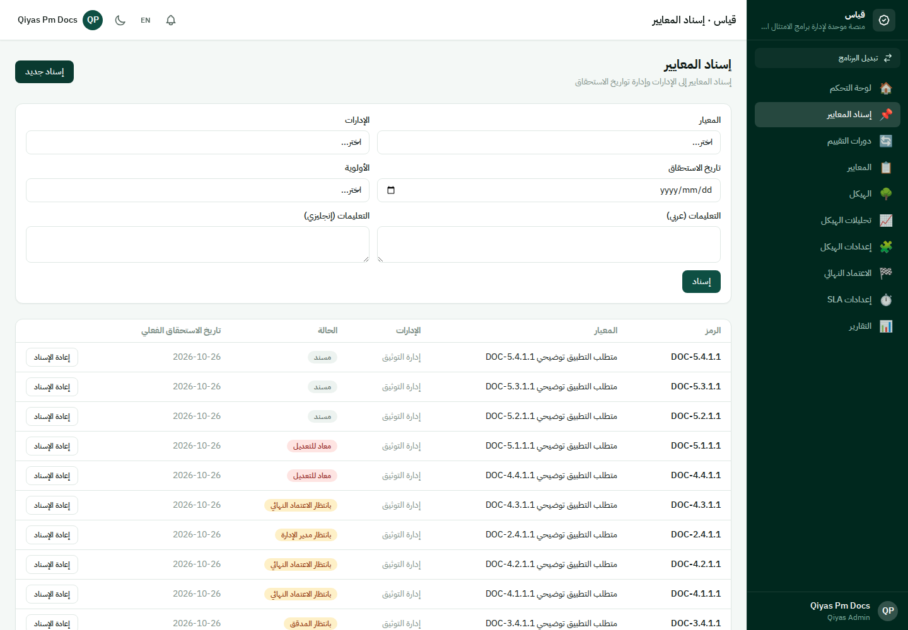

**شكل 15: نموذج إسناد معيار جديد**

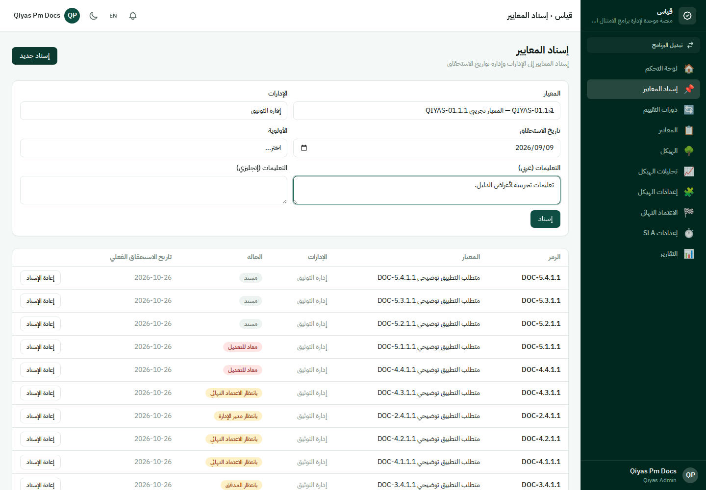

**شكل 16: نموذج الإسناد بعد اختيار المعيار والإدارة وتاريخ الاستحقاق والتعليمات**

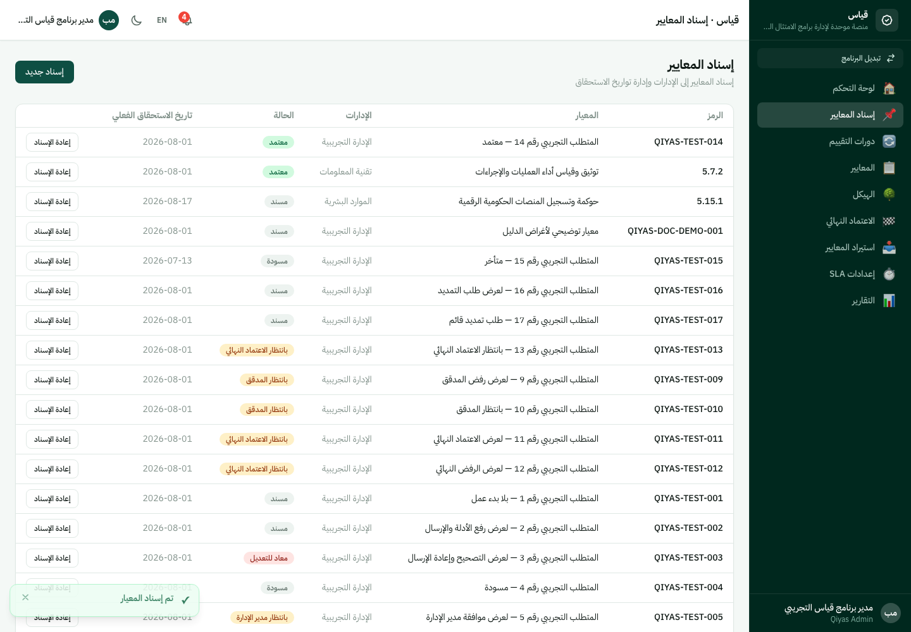

**شكل 17: رسالة تأكيد نجاح الإسناد**

### إجراء: إعادة إسناد معيار

| الحقل | التفصيل |
|---|---|
| **اسم الإجراء** | إعادة الإسناد |
| **الدور المسموح له** | مدير برنامج قياس، المسؤول العام |
| **الهدف** | نقل مسؤولية معيار مسند من إدارة إلى أخرى |
| **المتطلبات المسبقة** | سبب إعادة الإسناد إلزامي |
| **خطوات التنفيذ** | 1) من صف الإسناد، اضغط زر «إعادة الإسناد». 2) أدخل سبب إعادة الإسناد (إلزامي). 3) اختر الإدارة الجديدة. 4) أكِّد. |
| **النتيجة المتوقعة** | يُنشأ إسناد جديد، ويُلغى الإسناد القديم |
| **الحالة التالية** | مسند (للإدارة الجديدة) |
| **التنبيه** | إشعار للإدارة الجديدة بنوع `requirement_reassigned` |
| **ملاحظات** | — |
| **الأخطاء المحتملة** | ترك حقل السبب فارغًا يمنع الحفظ |
| **الصور المرتبطة** | شكل 18 |

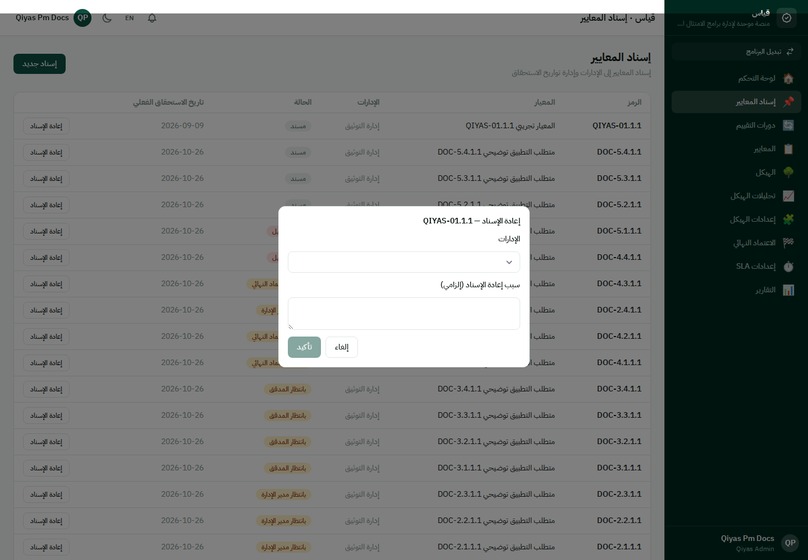

**شكل 18: نموذج إعادة الإسناد مع حقل السبب الإلزامي**

## 18.4 الاعتماد النهائي

هذا هو دور مدير برنامج قياس الأهم في سلسلة المراجعة: **الاعتماد النهائي** لكل متطلب اجتاز مراجعتي مدير الإدارة والمدقق بنجاح. يُشرح هذا الإجراء بالتفصيل الكامل (الموافقة والرفض) ضمن القسم 27 المخصص للرفض وإعادة الإرسال، والقسم 9 لسير العمل العام. لقطات الشاشة الخاصة بهذه المرحلة:

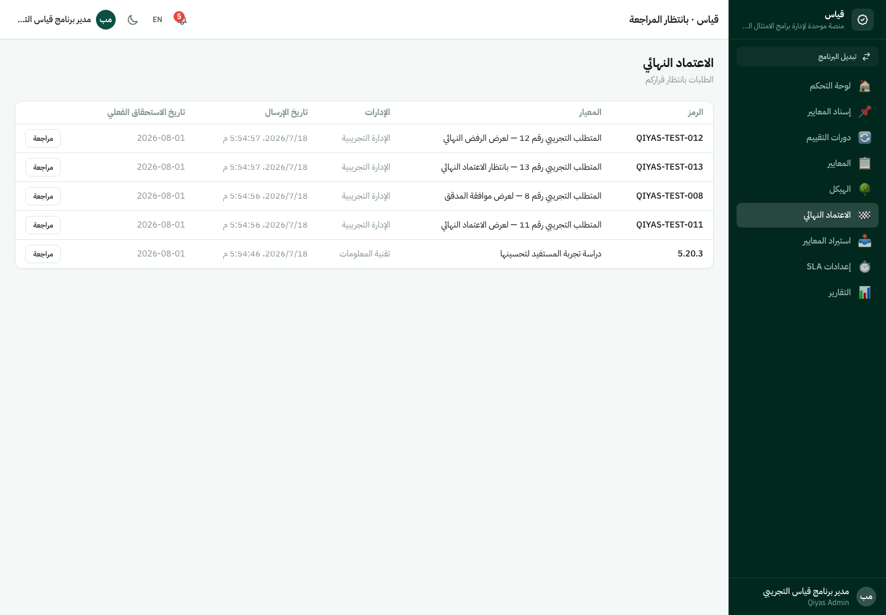

**شكل 19: قائمة انتظار الاعتماد النهائي**

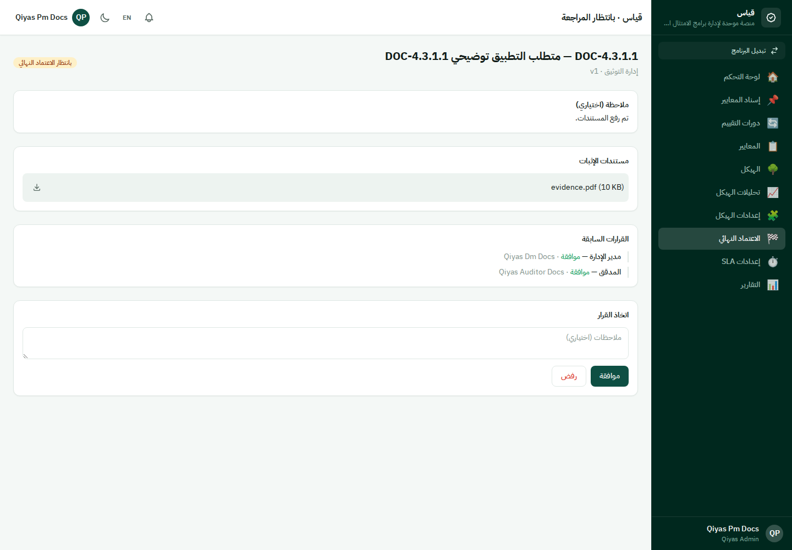

**شكل 20: تفاصيل الطلب في مرحلة الاعتماد النهائي، مع سجل القرارات السابقة**

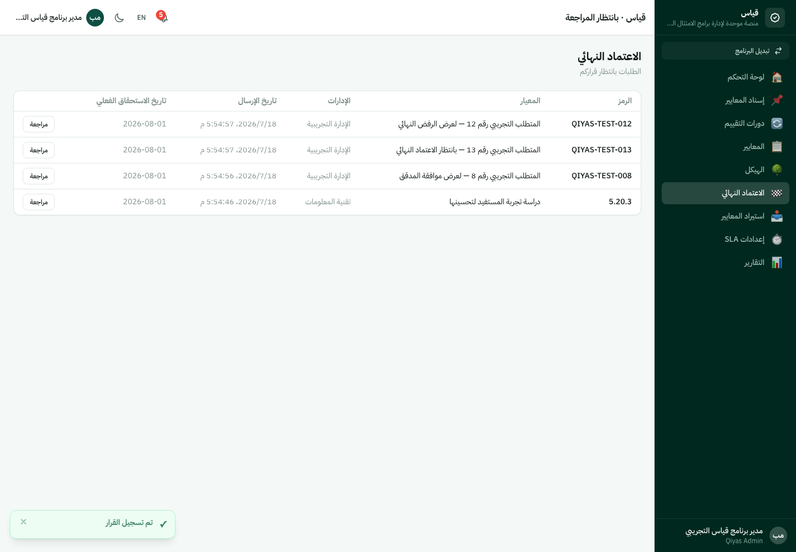

**شكل 21: رسالة تأكيد الاعتماد النهائي**

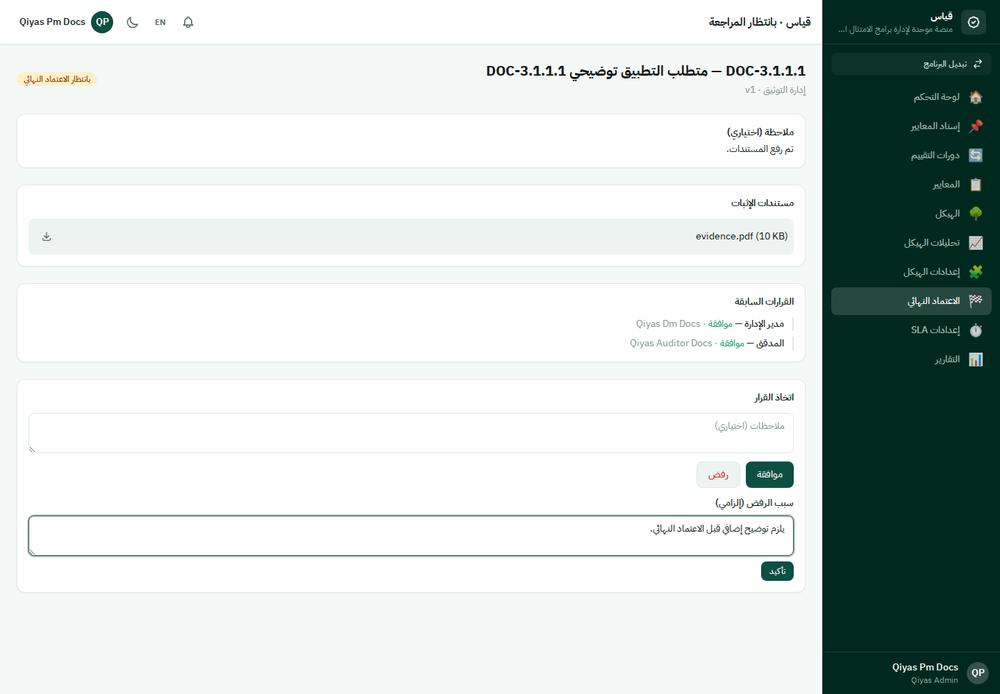

**شكل 22: نموذج رفض الاعتماد النهائي مع حقل السبب الإلزامي**

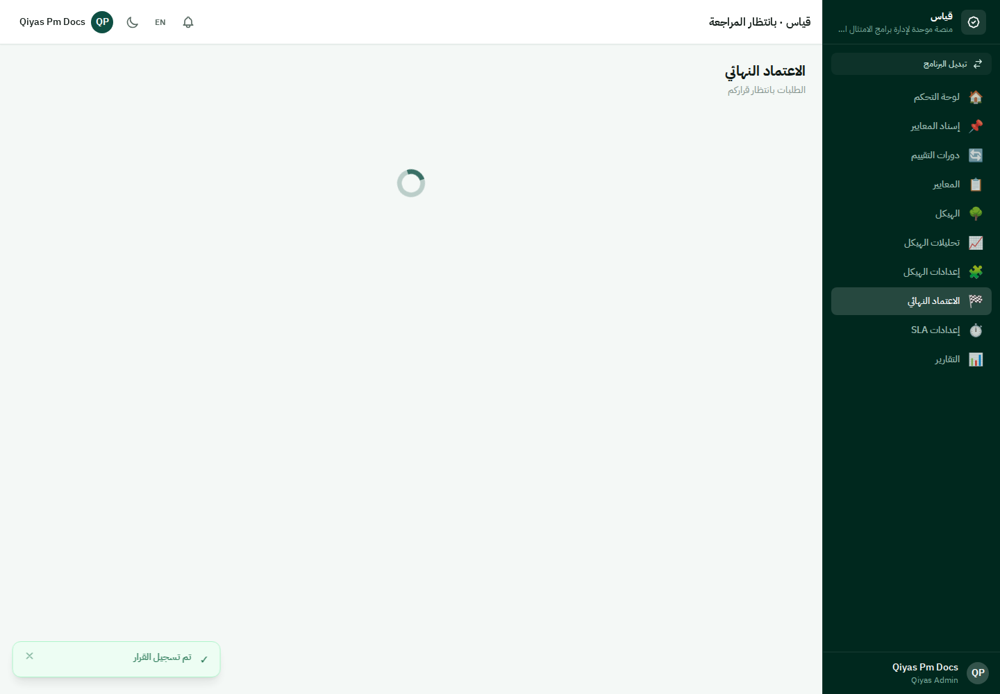

**شكل 23: رسالة تأكيد الرفض النهائي**

## 18.5 إعدادات SLA

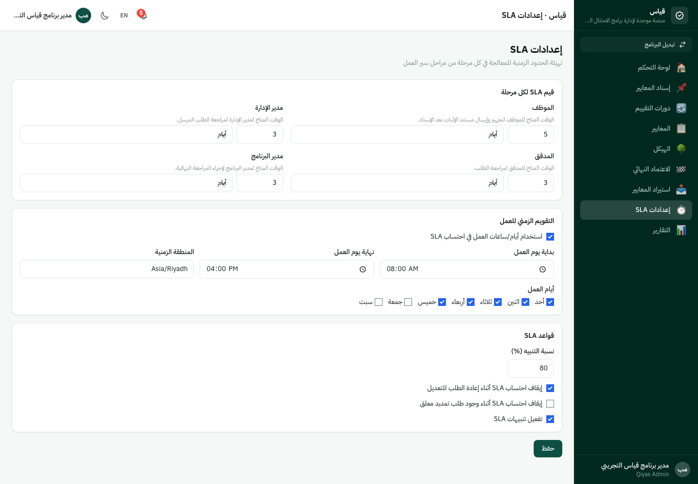

**شكل 24: شاشة إعدادات مهلات المراجعة (SLA) لكل مرحلة**

### إجراء: تعديل قيم SLA

| الحقل | التفصيل |
|---|---|
| **اسم الإجراء** | حفظ إعدادات SLA |
| **الدور المسموح له** | مدير برنامج قياس، المسؤول العام |
| **الهدف** | ضبط المهلة الزمنية المستهدفة (بالأيام) لكل مرحلة مراجعة |
| **المتطلبات المسبقة** | — |
| **خطوات التنفيذ** | 1) افتح «إعدادات SLA» من القائمة الجانبية. 2) عدِّل القيم المطلوبة. 3) اضغط زر «حفظ». |
| **النتيجة المتوقعة** | حفظ الإعدادات الجديدة وتطبيقها على المتطلبات القادمة |
| **الحالة التالية** | — |
| **التنبيه** | لا يوجد إشعار مستقل؛ الحفظ يتم داخل الصفحة مباشرة |
| **ملاحظات** | يُسجَّل التغيير في سجل التدقيق |
| **الأخطاء المحتملة** | قيمة سالبة أو غير رقمية |
| **الصور المرتبطة** | شكل 24، شكل 25 |

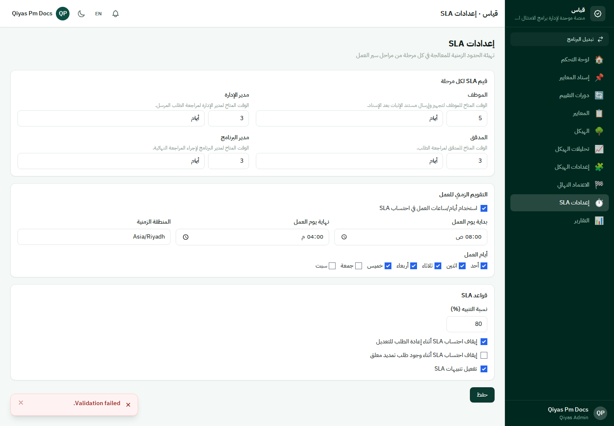

**شكل 25: الشاشة بعد حفظ التعديل على إعدادات SLA**

## 18.6 روابط شريط التنقّل الخاصة بمدير برنامج قياس

| الأيقونة | التسمية | الوجهة |
|---|---|---|
| 🏠 | لوحة التحكم | `/dashboard` |
| 📌 | إسناد المعايير | `/assignments` |
| 🔄 | دورات التقييم | `/cycles` |
| 📋 | المعايير | `/requirements` |
| 🌳 | الهيكل | `/hierarchy` (غير مُفعَّل لقياس — راجع الملاحظة أدناه) |
| 🏁 | الاعتماد النهائي | `/reviews/program-manager` |
| 📥 | استيراد المعايير | `/requirements-import` |
| ⏱️ | إعدادات SLA | `/sla-settings` |
| 📊 | التقارير | `/reports` |
| 🏢 | الإدارات | `/departments` |

> **ملاحظة عن رابط «الهيكل»**: يظهر هذا الرابط لمدير برنامج قياس ضمن القائمة الجانبية، إلا أن قياس **لا يستخدم فعليًا** محرك الهيكل الهرمي العام؛ فتح الرابط يعرض حالة «لا يوجد هيكل هرمي مُهيَّأ لهذا البرنامج» دائمًا، لأن قياس يعتمد على حقلي «المنظور» و«المحور» النصيَّين المباشرين ضمن كل معيار بدلًا من ذلك (راجع القسم 18.2).

---

# 19. دليل مدير الإدارة

مدير الإدارة هو المسؤول عن مراجعة الطلبات المُرسَلة من موظفي إدارته فقط، قبل تمريرها للمدقق.

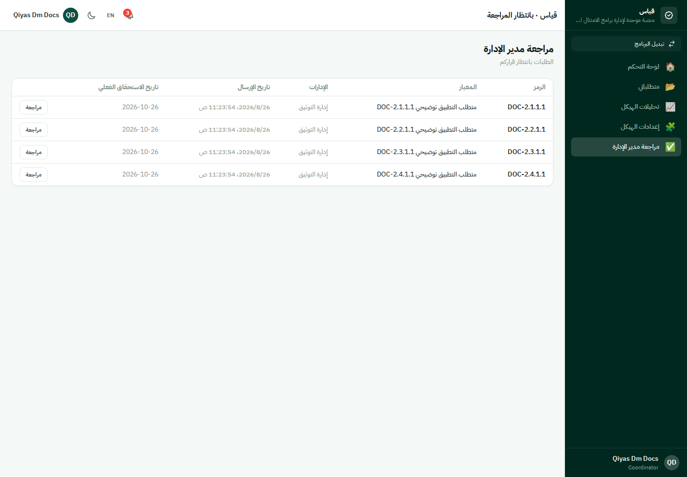

**شكل 26: قائمة انتظار مراجعة مدير الإدارة، محصورة بإدارته فقط**

### إجراء: الموافقة على طلب

| الحقل | التفصيل |
|---|---|
| **اسم الإجراء** | موافقة (مرحلة مدير الإدارة) |
| **الدور المسموح له** | مدير الإدارة (للطلبات ضمن إدارته فقط)، المسؤول العام |
| **الهدف** | إقرار اكتمال ومطابقة دليل الإثبات المرفوع من الموظف، وتمرير الطلب للمدقق |
| **المتطلبات المسبقة** | الطلب بانتظار هذه المرحلة تحديدًا (حالة «بانتظار مدير الإدارة») |
| **خطوات التنفيذ** | 1) من قائمة المراجعة، افتح الطلب. 2) اطّلع على تفاصيله والملف المرفق. 3) أدخل ملاحظات اختيارية. 4) اضغط زر «موافقة». |
| **النتيجة المتوقعة** | تظهر رسالة «تم تسجيل القرار» |
| **الحالة التالية** | بانتظار المدقق |
| **التنبيه** | إشعار للمدقق بنوع `submission_sent_to_auditor` |
| **ملاحظات** | — |
| **الأخطاء المحتملة** | — |
| **الصور المرتبطة** | شكل 27، شكل 28 |

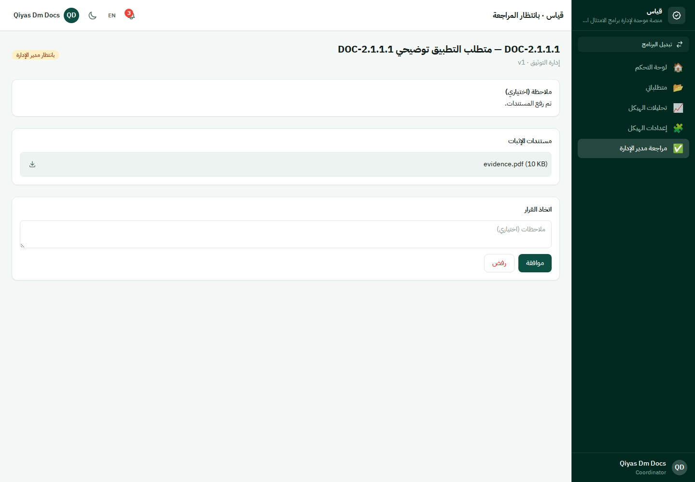

**شكل 27: تفاصيل طلب المراجعة قبل اتخاذ القرار**

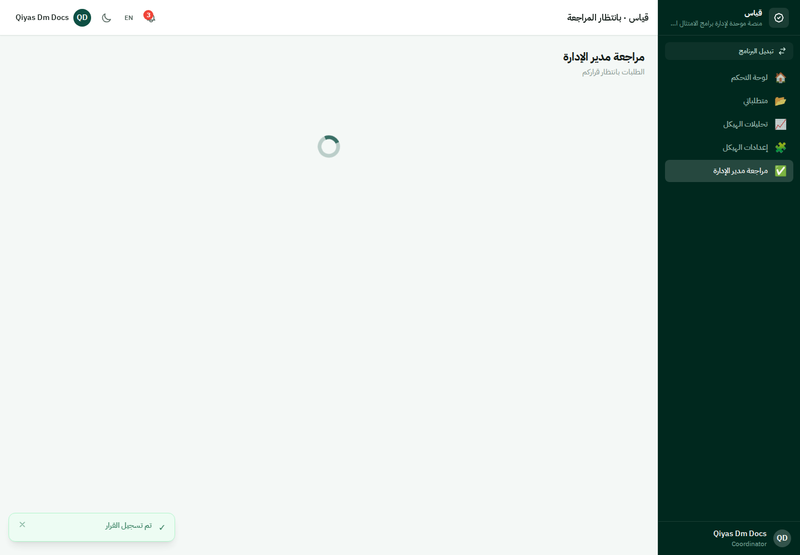

**شكل 28: رسالة تأكيد تسجيل قرار الموافقة**

### إجراء: رفض طلب

| الحقل | التفصيل |
|---|---|
| **اسم الإجراء** | رفض (مرحلة مدير الإدارة) |
| **الدور المسموح له** | مدير الإدارة (للطلبات ضمن إدارته فقط)، المسؤول العام |
| **الهدف** | إعادة الطلب للموظف لتصحيح نقص أو خلل في دليل الإثبات |
| **المتطلبات المسبقة** | سبب الرفض إلزامي |
| **خطوات التنفيذ** | 1) من تفاصيل الطلب، اضغط زر «رفض». 2) أدخل سبب الرفض (إلزامي). 3) أكِّد الرفض. |
| **النتيجة المتوقعة** | تظهر رسالة «تم تسجيل القرار» |
| **الحالة التالية** | معاد للتعديل (يعود للموظف — راجع القسم 27) |
| **التنبيه** | إشعار للموظف بنوع `department_manager_rejected` يتضمن سبب الرفض |
| **ملاحظات** | — |
| **الأخطاء المحتملة** | ترك حقل السبب فارغًا يمنع تأكيد الرفض |
| **الصور المرتبطة** | شكل 29، شكل 30 |

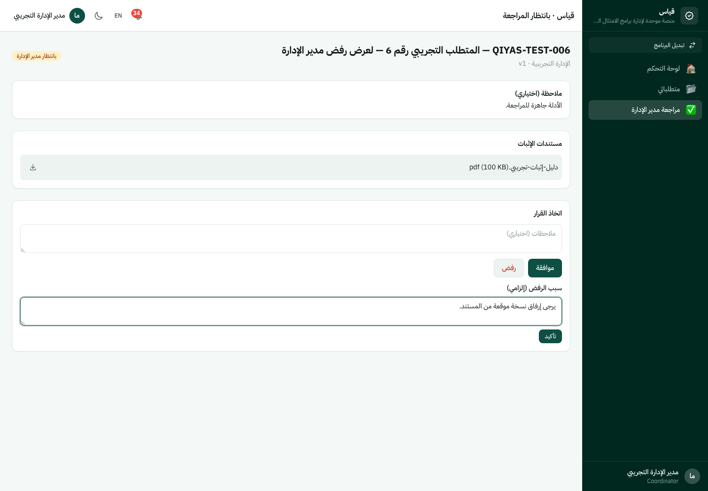

**شكل 29: نموذج الرفض مع حقل السبب الإلزامي**

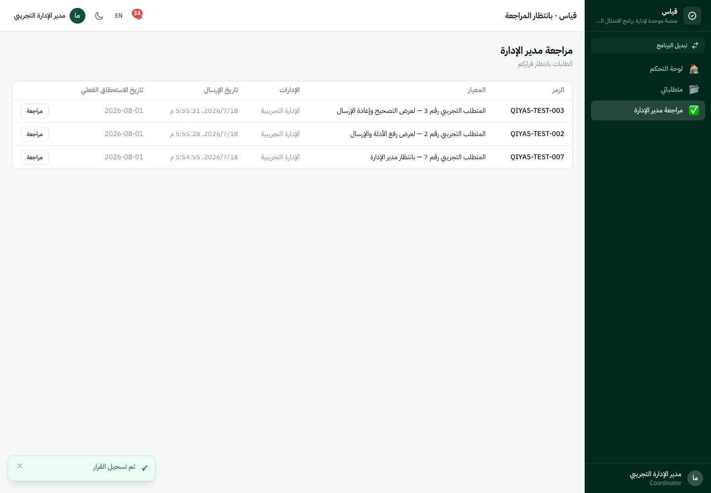

**شكل 30: رسالة تأكيد تسجيل قرار الرفض**

### ⛔ إجراءات غير متاحة لمدير الإدارة (تم التحقق منها فعليًا)

- **لا يمكنه** الوصول إلى قائمة الاعتماد النهائي (`/reviews/program-manager`) — تم التحقق من رفض الخادم لهذا الطلب صراحة (403)، حتى عند محاولة الوصول المباشر بدون المرور بالواجهة.
- **لا يمكنه** إنشاء أو تعديل دورات التقييم، أو إسناد المعايير.
- **لا يمكنه** الوصول لإعدادات النظام العامة أو التقارير.

### روابط شريط التنقّل الخاصة بمدير الإدارة

| الأيقونة | التسمية | الوجهة |
|---|---|---|
| 🏠 | لوحة التحكم | `/dashboard` |
| ✅ | مراجعة مدير الإدارة | `/reviews/department-manager` |

---

# 20. دليل المدقق

المدقق هو المسؤول عن مراجعة الطلبات على مستوى البرنامج بالكامل (وليس إدارة واحدة)، بعد موافقة مدير الإدارة، بالإضافة إلى البتّ في طلبات التمديد.

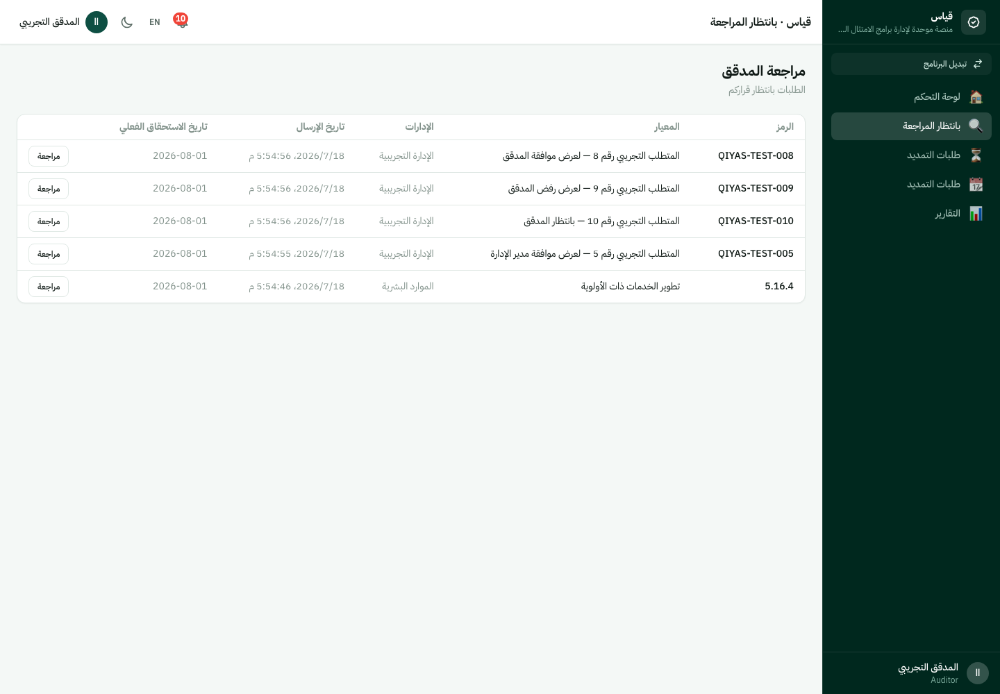

**شكل 31: قائمة انتظار مراجعة المدقق، على مستوى البرنامج بالكامل**

### إجراء: الموافقة على طلب

| الحقل | التفصيل |
|---|---|
| **اسم الإجراء** | موافقة (مرحلة المدقق) |
| **الدور المسموح له** | المدقق، المسؤول العام |
| **الهدف** | التحقق الفني من دليل الإثبات بعد موافقة مدير الإدارة، وتمرير الطلب للاعتماد النهائي |
| **المتطلبات المسبقة** | الطلب بانتظار هذه المرحلة (حالة «بانتظار المدقق») |
| **خطوات التنفيذ** | 1) من قائمة مراجعة المدقق، افتح الطلب. 2) اطّلع على سجل القرارات السابقة والملف المرفق. 3) اضغط زر «موافقة». |
| **النتيجة المتوقعة** | تظهر رسالة «تم تسجيل القرار» |
| **الحالة التالية** | بانتظار الاعتماد النهائي |
| **التنبيه** | إشعار لمدير برنامج قياس بنوع `submission_sent_to_program_manager` |
| **ملاحظات** | تعرض شاشة التفاصيل سجل القرارات السابقة (بما فيها قرار مدير الإدارة) لمساعدة المدقق على المراجعة |
| **الأخطاء المحتملة** | — |
| **الصور المرتبطة** | شكل 32، شكل 33 |

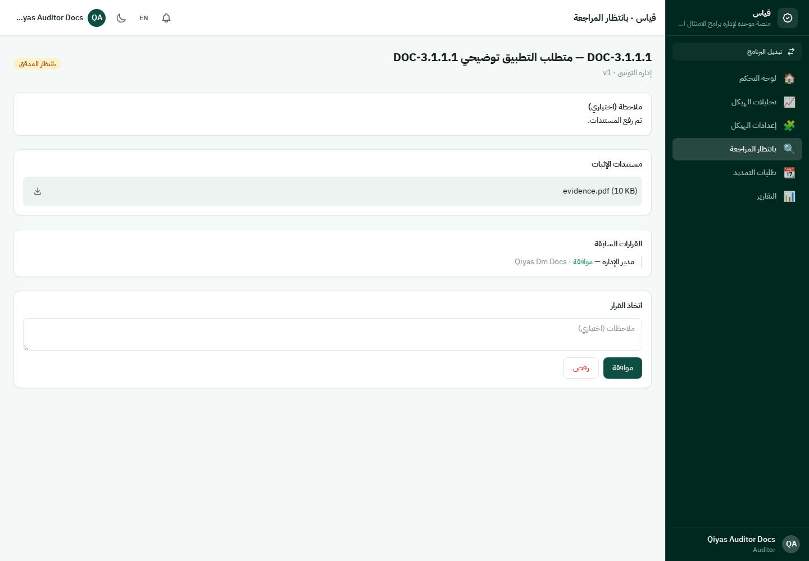

**شكل 32: تفاصيل الطلب مع سجل القرارات السابقة**

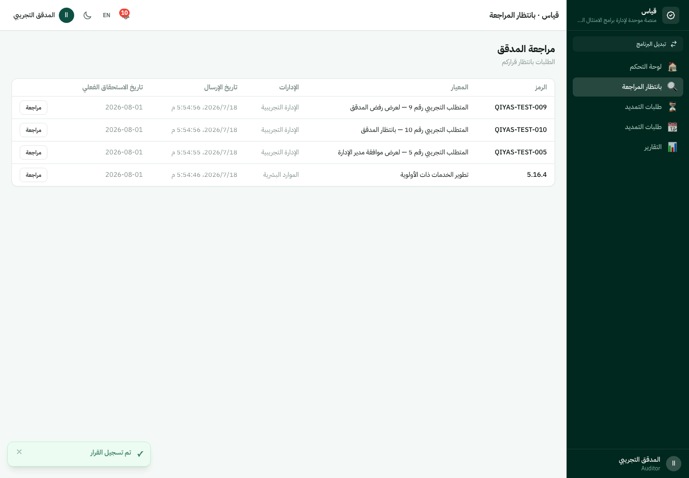

**شكل 33: رسالة تأكيد الموافقة**

### إجراء: رفض طلب

| الحقل | التفصيل |
|---|---|
| **اسم الإجراء** | رفض (مرحلة المدقق) |
| **الدور المسموح له** | المدقق، المسؤول العام |
| **الهدف** | إعادة الطلب للموظف عند عدم مطابقة الدليل لمتطلبات المعيار فنيًا |
| **المتطلبات المسبقة** | سبب الرفض إلزامي |
| **خطوات التنفيذ** | 1) من تفاصيل الطلب، اضغط زر «رفض». 2) أدخل سبب الرفض. 3) أكِّد. |
| **النتيجة المتوقعة** | تظهر رسالة «تم تسجيل القرار» |
| **الحالة التالية** | معاد للتعديل (يعود للموظف — راجع القسم 27) |
| **التنبيه** | إشعار للموظف بنوع `auditor_rejected` |
| **ملاحظات** | — |
| **الأخطاء المحتملة** | ترك حقل السبب فارغًا |
| **الصور المرتبطة** | شكل 34 |

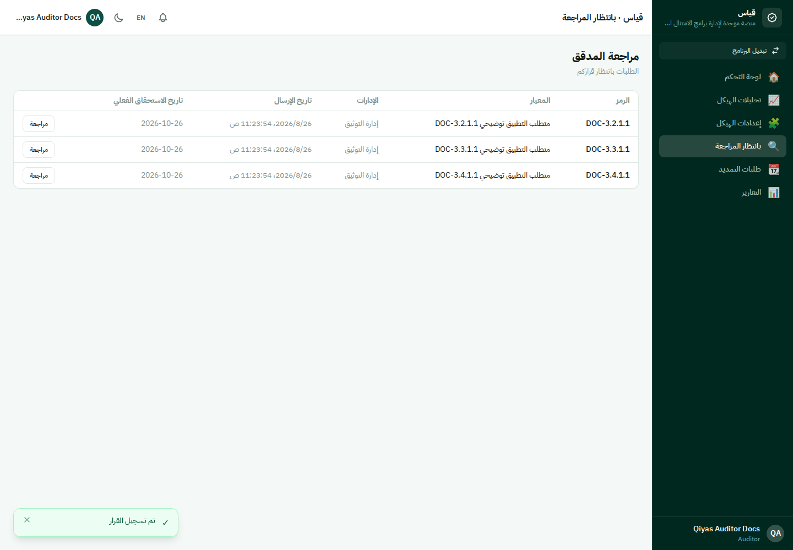

**شكل 34: رسالة تأكيد الرفض**

## 20.1 طلبات التمديد (مسار المدقق)

راجع القسم 25 للشرح الكامل لمسار طلب التمديد من جهة الموظف والمدقق معًا.

### ⛔ إجراءات غير متاحة للمدقق (تم التحقق منها فعليًا)

- **لا يمكنه** إنشاء دورة تقييم — تم التحقق من رفض الخادم (403).
- **لا يمكنه** الوصول لقائمة الاعتماد النهائي أو إسناد المعايير.

### روابط شريط التنقّل الخاصة بالمدقق

| الأيقونة | التسمية (كما تظهر في القائمة الجانبية) | الوجهة |
|---|---|---|
| 🏠 | لوحة التحكم | `/dashboard` |
| 🔍 | بانتظار المراجعة | `/reviews/auditor` |
| ⏳ | طلبات التمديد | `/auditor/extensions` (مسار قديم بديل) |
| 📆 | طلبات التمديد | `/extension-requests` |
| 📊 | التقارير | `/reports` |

---

# 21. دليل الموظف

الموظف هو المسؤول عن رفع أدلة الإثبات على المتطلبات المُسندة لإدارته وإرسالها للمراجعة.

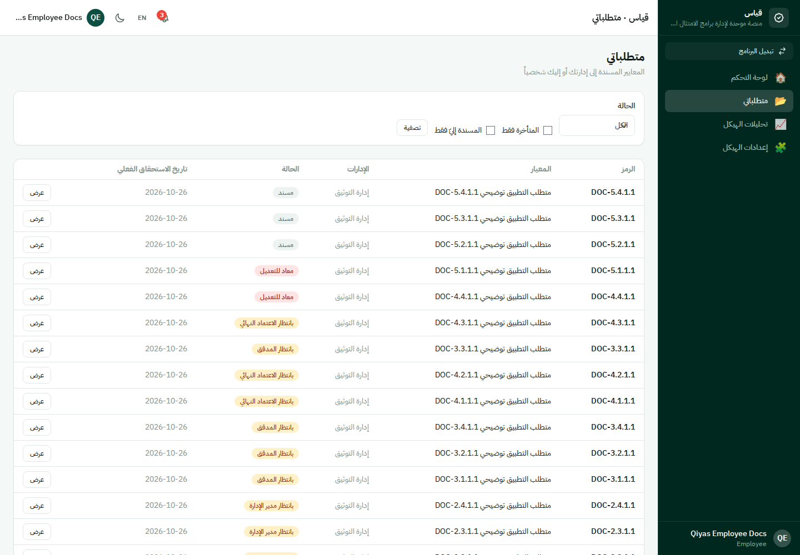

**شكل 35: قائمة «متطلباتي» — تعرض المتطلبات المسندة لإدارة الموظف**

### إجراء: رفع دليل إثبات وحفظه كمسودة

| الحقل | التفصيل |
|---|---|
| **اسم الإجراء** | رفع دليل إثبات |
| **الدور المسموح له** | الموظف (ضمن إدارته فقط، أو الموظف المُحدَّد بعينه إن وُجد) |
| **الهدف** | إرفاق الملف الذي يثبت تنفيذ المتطلب |
| **المتطلبات المسبقة** | المتطلب بحالة «مسودة» أو «معاد للتعديل» |
| **خطوات التنفيذ** | 1) من «متطلباتي»، افتح المتطلب المطلوب. 2) اضغط زر رفع الملف واختر الملف من جهازك. 3) أضف تعليقًا اختياريًا يوضّح محتوى الدليل. |
| **النتيجة المتوقعة** | تظهر رسالة «تم رفع الملف»، ويُضاف الملف لقائمة المرفقات |
| **الحالة التالية** | تبقى «مسودة» حتى الإرسال الصريح للمراجعة |
| **التنبيه** | لا يوجد إشعار منفصل؛ يُسجَّل الرفع في السجل الزمني للطلب فقط |
| **ملاحظات** | يمكن رفع أكثر من ملف واحد قبل الإرسال |
| **الأخطاء المحتملة** | نوع ملف أو حجم غير مدعوم |
| **الصور المرتبطة** | شكل 36، شكل 37 |

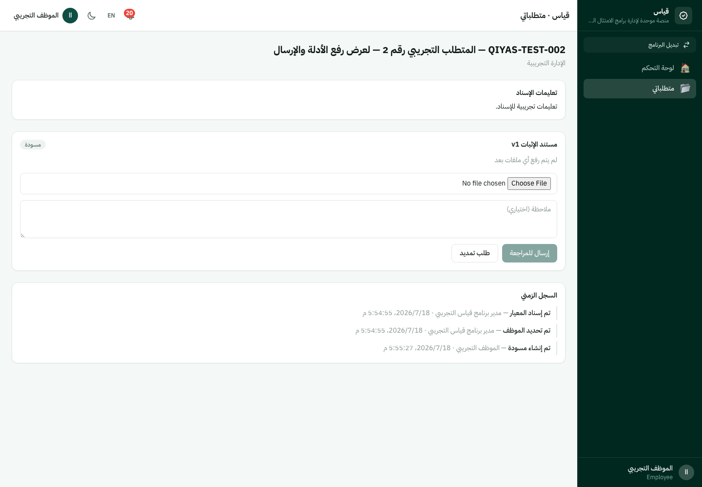

**شكل 36: تفاصيل المتطلب قبل رفع أي دليل إثبات**

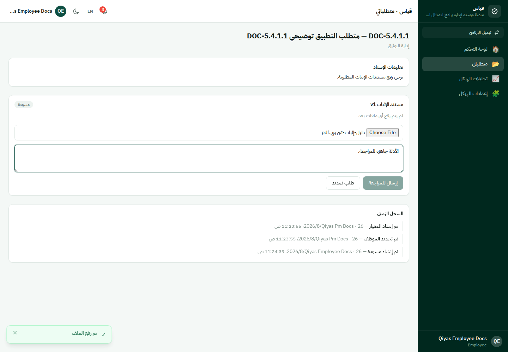

**شكل 37: المتطلب بحالة مسودة بعد رفع الملف وإضافة تعليق الموظف**

### إجراء: إرسال المتطلب للمراجعة

| الحقل | التفصيل |
|---|---|
| **اسم الإجراء** | إرسال للمراجعة |
| **الدور المسموح له** | الموظف |
| **الهدف** | تحويل الطلب رسميًا لبدء سلسلة المراجعات |
| **المتطلبات المسبقة** | وجود ملف إثبات واحد على الأقل مرفوع |
| **خطوات التنفيذ** | 1) بعد رفع الدليل، اضغط زر «إرسال للمراجعة». |
| **النتيجة المتوقعة** | تظهر رسالة «تم الإرسال للمراجعة» |
| **الحالة التالية** | بانتظار مدير الإدارة |
| **التنبيه** | إشعار لمدير الإدارة بنوع `submission_sent_to_department_manager` |
| **ملاحظات** | لا يمكن التراجع عن الإرسال ذاتيًا من واجهة الموظف؛ الطلب يصبح في عهدة مدير الإدارة |
| **الأخطاء المحتملة** | محاولة الإرسال دون أي ملف مرفق |
| **الصور المرتبطة** | شكل 38 |

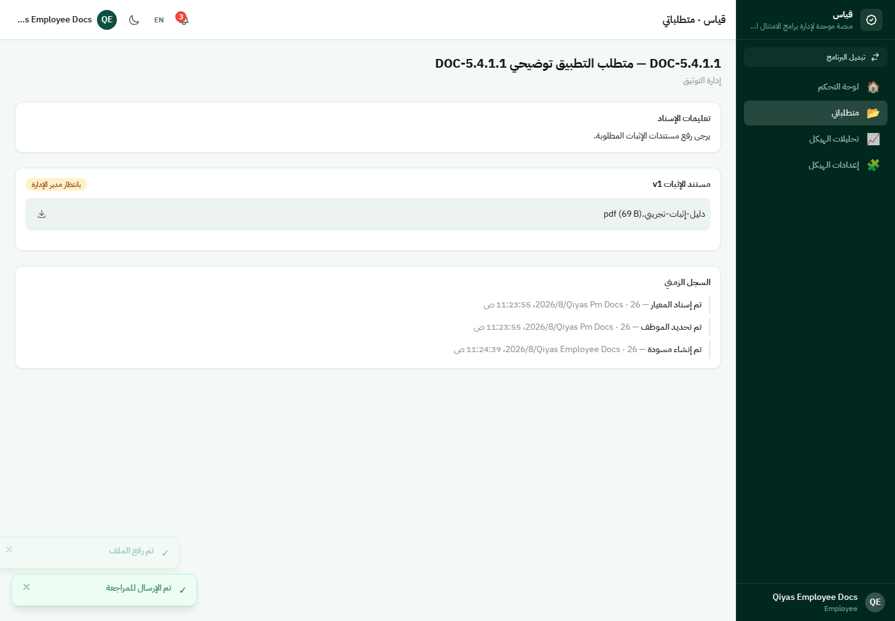

**شكل 38: رسالة تأكيد إرسال المتطلب للمراجعة**

### إجراء: تصحيح متطلب مرفوض وإعادة إرساله

| الحقل | التفصيل |
|---|---|
| **اسم الإجراء** | تصحيح وإعادة الإرسال |
| **الدور المسموح له** | الموظف |
| **الهدف** | معالجة سبب الرفض المُسجَّل من أي مرحلة مراجعة، وإعادة الطلب لدورة المراجعة |
| **المتطلبات المسبقة** | المتطلب بحالة «معاد للتعديل» |
| **خطوات التنفيذ** | 1) افتح المتطلب، ولاحظ شريط سبب الرفض أعلى الصفحة. 2) ارفع الملف المصحَّح. 3) أضف تعليقًا يوضّح التصحيح. 4) اضغط «إرسال للمراجعة». |
| **النتيجة المتوقعة** | تظهر رسالة «تم الإرسال للمراجعة» |
| **الحالة التالية** | بانتظار مدير الإدارة **(دائمًا، بصرف النظر عن المرحلة التي رفضت الطلب أصلًا — راجع القسم 27)** |
| **التنبيه** | إشعار لمدير الإدارة كأنه طلب جديد |
| **ملاحظات** | سبب الرفض يبقى ظاهرًا في شريط أعلى الصفحة لحين تصحيحه |
| **الأخطاء المحتملة** | — |
| **الصور المرتبطة** | شكل 39، شكل 40، شكل 41 |

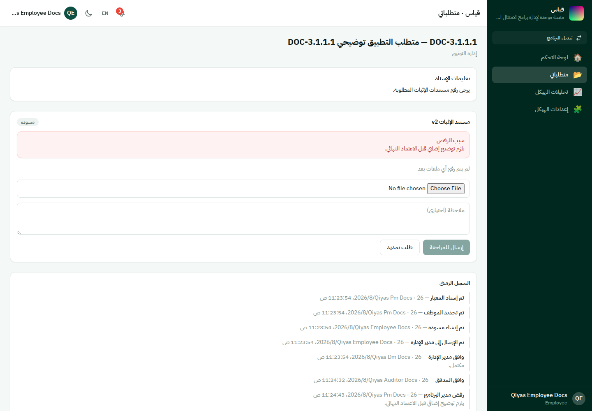

**شكل 39: شريط سبب الرفض الظاهر للموظف بعد إعادة المتطلب للتعديل**

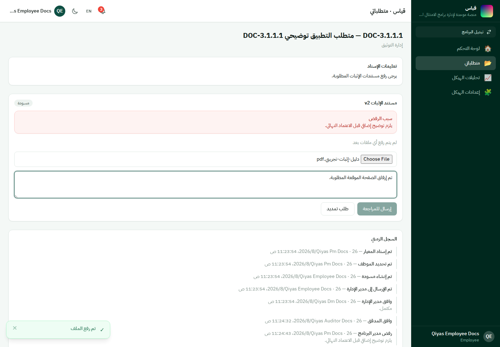

**شكل 40: المتطلب بعد رفع الدليل المصحَّح**

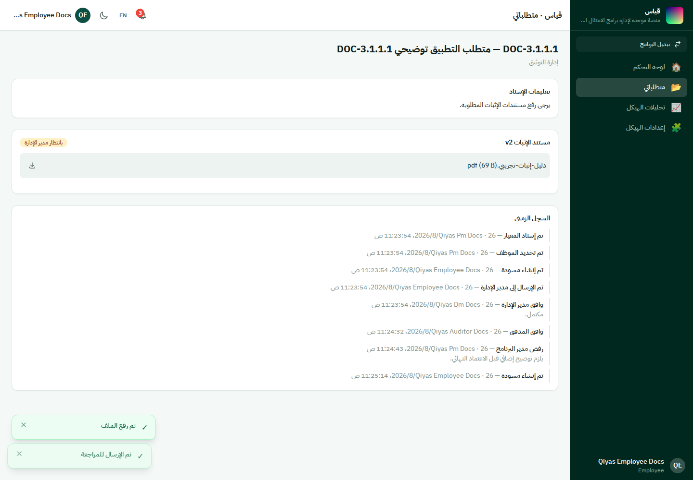

**شكل 41: رسالة تأكيد إعادة الإرسال بعد التصحيح**

### إجراء: طلب تمديد الموعد النهائي

راجع القسم 25 للشرح التفصيلي الكامل لهذا الإجراء.

### ⚠️ ملاحظة موثقة: لا توجد شاشة لعرض المتطلبات المعتمدة نهائيًا

بمجرد اعتماد متطلب اعتمادًا نهائيًا من مدير برنامج قياس، **يختفي هذا المتطلب من قائمة «متطلباتي» الخاصة بالموظف بالكامل**. تم التحقق من هذا السلوك مباشرة عبر استجابة الخادم الفعلية: من أصل 18 متطلبًا مُسندًا، أعادت القائمة 16 فقط بعد اعتماد اثنين منهما نهائيًا. **لا توجد حاليًا أي صفحة يستطيع من خلالها الموظف تصفّح سجل متطلباته المعتمدة سابقًا**؛ التأكيد الوحيد المرئي للموظف على نجاح الاعتماد هو رسالة التأكيد التي يراها مدير البرنامج عند اعتماده (شكل 21 في القسم 18.4)، أو الإشعار الذي يصله (راجع القسم 24). هذا قيد حقيقي مؤكَّد من التطبيق، وليس نقصًا في التقاط لقطات هذا الدليل.

### روابط شريط التنقّل الخاصة بالموظف

| الأيقونة | التسمية | الوجهة |
|---|---|---|
| 🏠 | لوحة التحكم | `/dashboard` |
| 📂 | متطلباتي | `/my-requirements` |
| 🔔 | الإشعارات | `/notifications` |

---

# 22. دليل المشاهد التنفيذي

المشاهد التنفيذي يملك صلاحية **عرض فقط** على لوحة تنفيذية عامة للمنصة، دون أي إمكانية تعديل أو اتخاذ قرار.

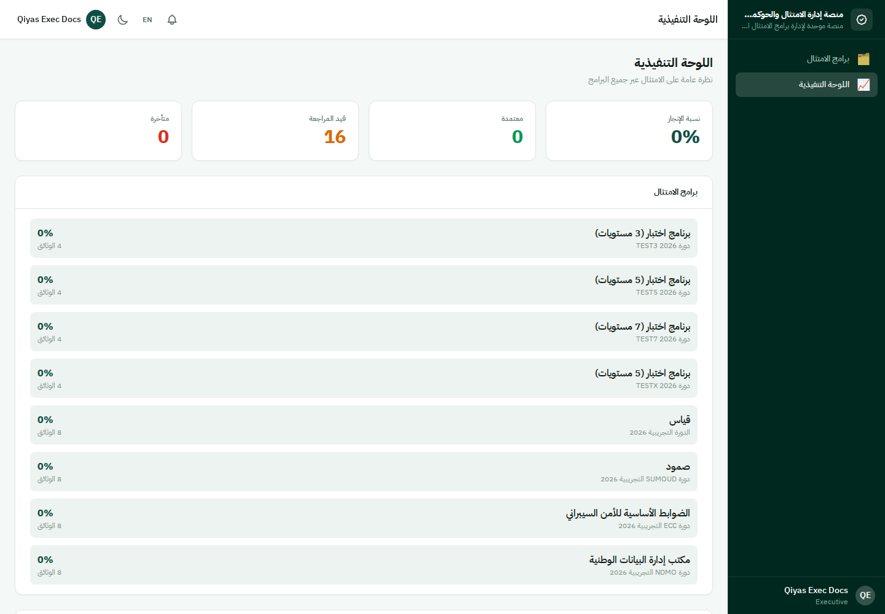

**شكل 42: اللوحة التنفيذية — تم التحقق برمجيًا من خلو الصفحة بالكامل من أي زر تعديل أو اعتماد أو رفض أو حذف**

### إجراء: عرض اللوحة التنفيذية

| الحقل | التفصيل |
|---|---|
| **اسم الإجراء** | عرض اللوحة التنفيذية |
| **الدور المسموح له** | المشاهد التنفيذي، المسؤول العام |
| **الهدف** | الاطّلاع السريع على مؤشرات الامتثال العامة عبر البرامج |
| **المتطلبات المسبقة** | — |
| **خطوات التنفيذ** | 1) من شريط التنقّل العلوي، افتح «اللوحة التنفيذية». |
| **النتيجة المتوقعة** | عرض فقط دون أي عناصر تحكم |
| **الحالة التالية** | — |
| **التنبيه** | — |
| **ملاحظات** | تم التحقق آليًا (فحص برمجي لكل زر في الصفحة) من عدم وجود أي زر يحمل نص «حفظ» أو «تعديل» أو «حذف» أو «إضافة» أو «اعتماد» أو «رفض» أو «إسناد» في هذه الصفحة |
| **الأخطاء المحتملة** | — |
| **الصور المرتبطة** | شكل 42، شكل 43 |

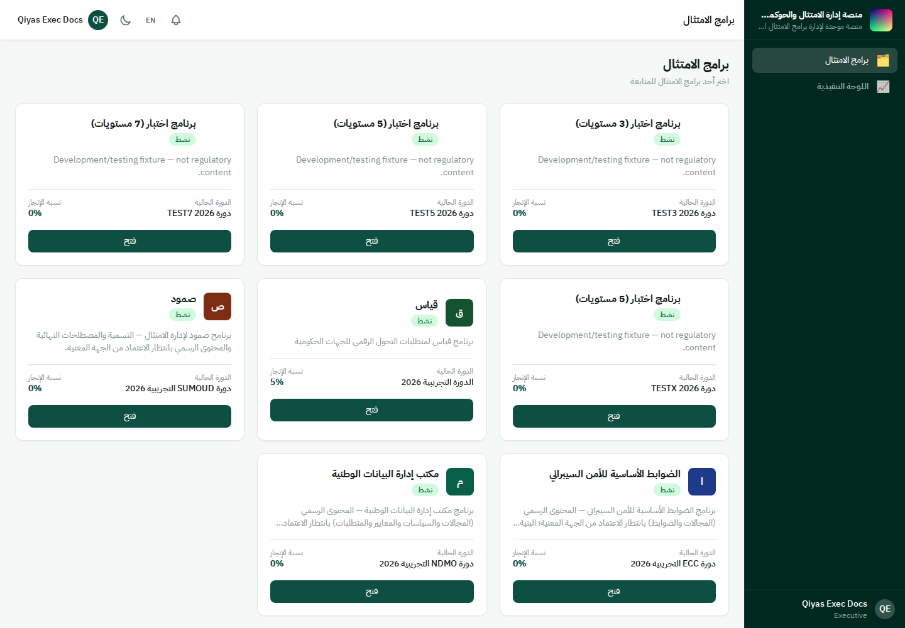

**شكل 43: شاشة اختيار البرنامج كما تظهر لحساب المشاهد التنفيذي**

---

# 23. دليل المسؤول العام (وظائف قياس فقط)

يملك المسؤول العام (Super Admin) صلاحية كاملة عبر المنصة بأكملها، بما يشمل جميع وظائف قياس الموثَّقة في الأقسام 18–22 دون استثناء (إنشاء الدورات، الإسناد، جميع مراحل المراجعة، الاعتماد النهائي، إعدادات SLA، التقارير).

**الفارق الجوهري بينه وبين مدير برنامج قياس**: المسؤول العام يملك أيضًا وظائف على مستوى المنصة بأكملها، خارج نطاق أي برنامج امتثال بعينه، وهي:

| الوظيفة | الوصف | ملاحظة |
|---|---|---|
| إدارة مستخدمي المنصة | إنشاء/تعديل حسابات المستخدمين وأدوارهم عبر جميع البرامج | خارج نطاق هذا الدليل (وظيفة منصّة عامة) |
| الإعدادات العامة للنظام | إعدادات لا تخص برنامجًا بعينه | تم التحقق من **حظرها صراحة** حتى عن مدير برنامج قياس، وهي حكرًا على المسؤول العام |
| سجل التدقيق على مستوى المنصة | سجل شامل لكل الأحداث عبر جميع البرامج | متاح أيضًا للمدقق |
| سجل البريد الإلكتروني | سجل الرسائل الصادرة من النظام | حكرًا على المسؤول العام |

> هذا القسم لا يشرح هذه الوظائف بالتفصيل لأنها **ليست خاصة ببرنامج قياس**، وتقع خارج نطاق هذا الدليل بنص التكليف. الهدف من هذا القسم هو توضيح **الفارق الواضح** بين صلاحيات المسؤول العام ومدير برنامج قياس فحسب، لا شرح دليل إدارة كامل للمنصة.

---

# 24. الإشعارات

مركز الإشعارات (`/notifications`) متاح لجميع الأدوار، ويعرض لكل مستخدم إشعاراته الشخصية فقط.

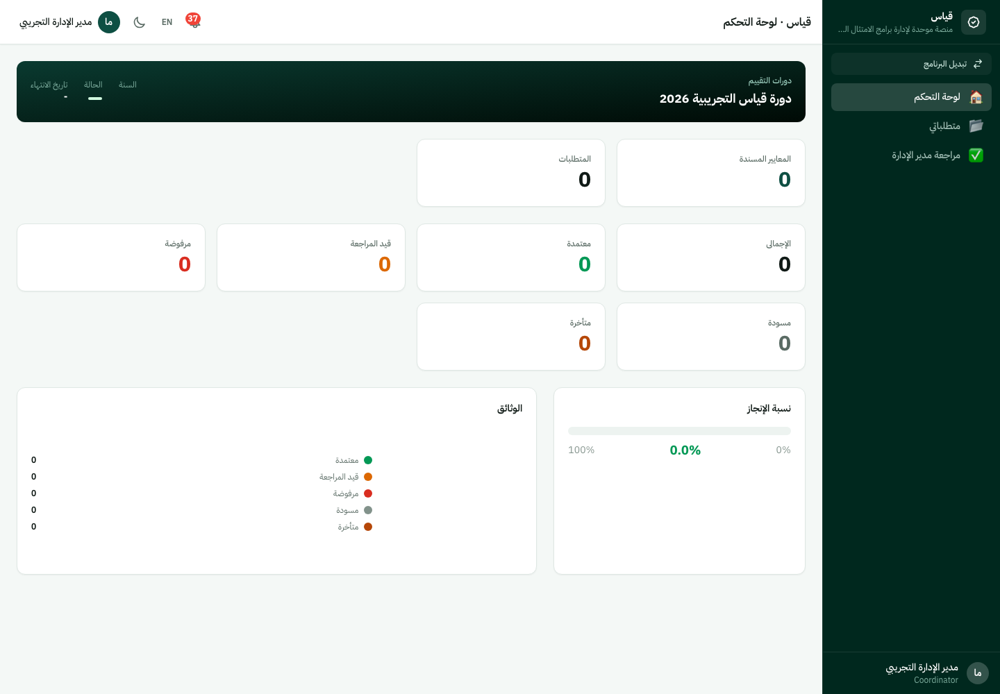

**شكل 44: أيقونة الجرس مع شارة عدد الإشعارات غير المقروءة**

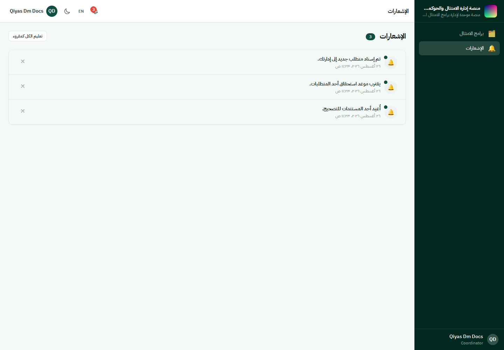

**شكل 45: قائمة مركز الإشعارات**

### إجراء: تعليم جميع الإشعارات كمقروءة

| الحقل | التفصيل |
|---|---|
| **اسم الإجراء** | تعليم الكل كمقروء |
| **الدور المسموح له** | جميع الأدوار (لإشعاراتهم الشخصية فقط) |
| **الهدف** | تصفير عداد الإشعارات غير المقروءة دفعة واحدة |
| **المتطلبات المسبقة** | وجود إشعار واحد غير مقروء على الأقل — **الزر معطَّل تلقائيًا إن لم يوجد أي إشعار غير مقروء** |
| **خطوات التنفيذ** | 1) من قائمة الإشعارات، اضغط زر «تعليم الكل كمقروء». |
| **النتيجة المتوقعة** | تختفي شارة العدد، وتُعلَّم جميع الإشعارات كمقروءة |
| **الحالة التالية** | — |
| **التنبيه** | — |
| **ملاحظات** | — |
| **الأخطاء المحتملة** | — |
| **الصور المرتبطة** | شكل 46 |

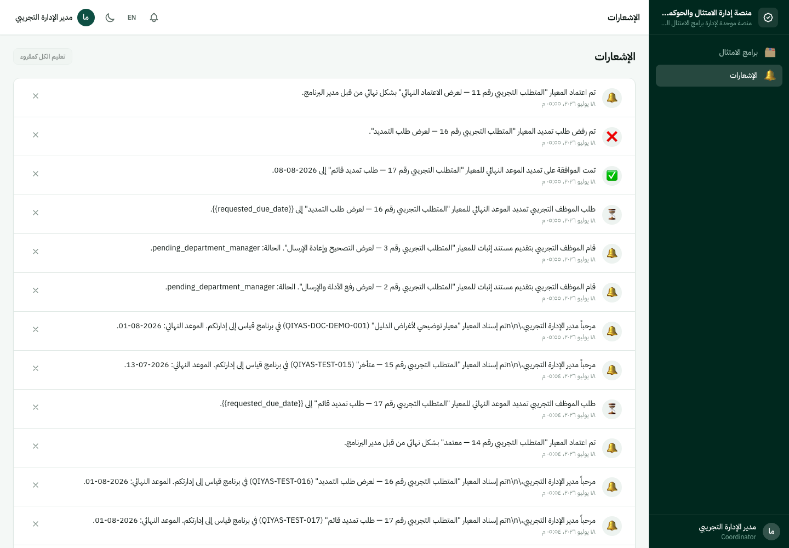

**شكل 46: القائمة بعد استخدام «تعليم الكل كمقروء»**

### إجراء: حذف إشعار

| الحقل | التفصيل |
|---|---|
| **اسم الإجراء** | حذف إشعار |
| **الدور المسموح له** | جميع الأدوار (لإشعاراتهم الشخصية فقط) |
| **الهدف** | إزالة إشعار واحد من القائمة نهائيًا |
| **المتطلبات المسبقة** | — |
| **خطوات التنفيذ** | 1) اضغط زر «حذف» بجانب الإشعار المطلوب. |
| **النتيجة المتوقعة** | يختفي الإشعار من القائمة فورًا |
| **الحالة التالية** | — |
| **التنبيه** | — |
| **ملاحظات** | تم التحقق مباشرة من الكود أن الحذف يؤثر على إشعارات المستخدم الحالي فقط، ولا يمتد لأي مستخدم آخر |
| **الأخطاء المحتملة** | — |
| **الصور المرتبطة** | شكل 47 |

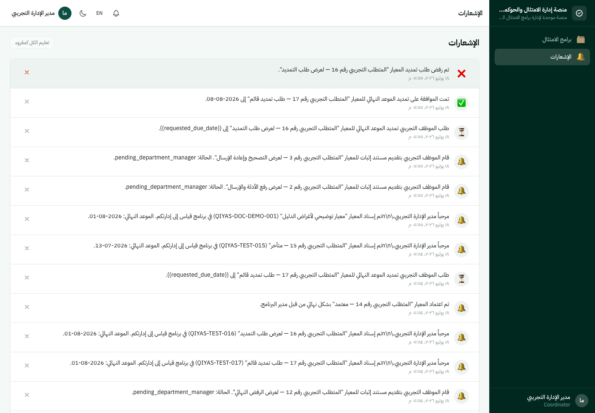

**شكل 47: القائمة بعد حذف إشعار واحد**

---

# 25. طلبات التمديد

طلب التمديد مسار مستقل يتيح للموظف طلب تمديد الموعد النهائي لمتطلب معيّن.

### إجراء: طلب تمديد (من جهة الموظف)

| الحقل | التفصيل |
|---|---|
| **اسم الإجراء** | طلب تمديد |
| **الدور المسموح له** | الموظف |
| **الهدف** | طلب موعد استحقاق جديد لمتطلب يصعب إنجازه ضمن الموعد الحالي |
| **المتطلبات المسبقة** | عدم وجود طلب تمديد معلَّق سابق على نفس المتطلب، والتاريخ الجديد لاحق للتاريخ الحالي |
| **خطوات التنفيذ** | 1) من تفاصيل المتطلب، اضغط زر «طلب تمديد». 2) أدخل التاريخ الجديد المطلوب. 3) أدخل السبب. 4) اضغط زر الإرسال. |
| **النتيجة المتوقعة** | تظهر رسالة «تم إرسال طلب التمديد» |
| **الحالة التالية** | قيد الانتظار |
| **التنبيه** | إشعار للجهة المخوَّلة بالبتّ (المدقق افتراضيًا — راجع القسم 35) بنوع `extension_requested` |
| **ملاحظات** | — |
| **الأخطاء المحتملة** | تاريخ سابق للتاريخ الحالي، أو طلب معلَّق موجود بالفعل |
| **الصور المرتبطة** | شكل 48، شكل 49 |

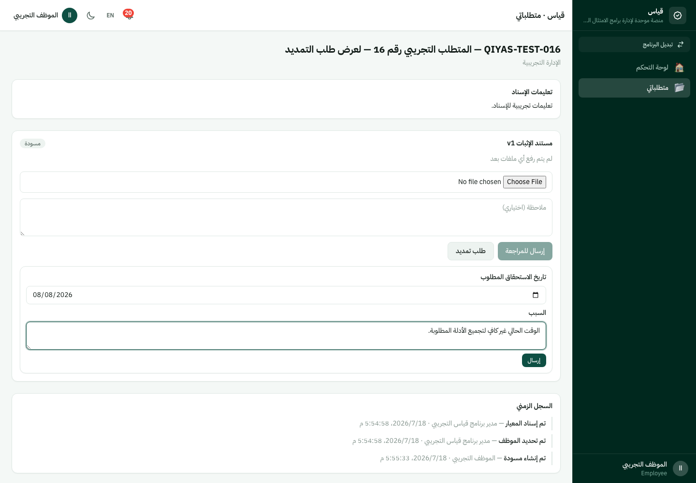

**شكل 48: نموذج طلب تمديد الموعد النهائي بعد تعبئة التاريخ والسبب**

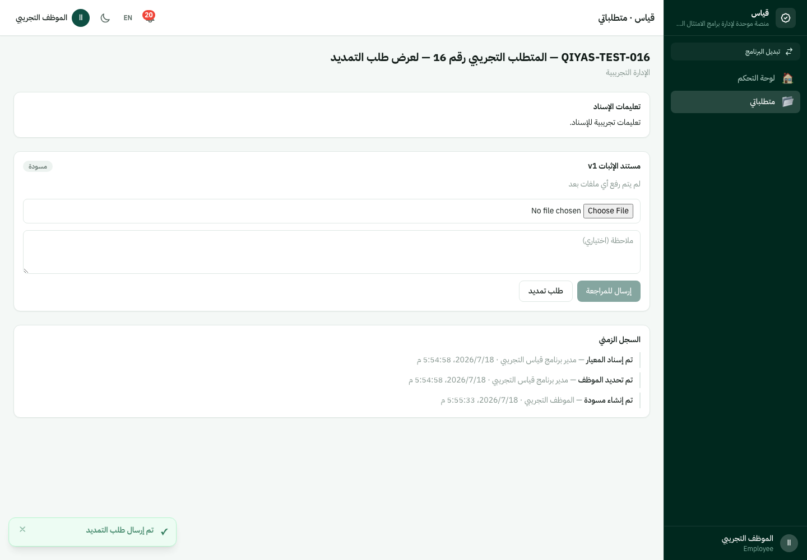

**شكل 49: رسالة تأكيد إرسال طلب التمديد**

## 25.1 البتّ في طلبات التمديد (من جهة المدقق)

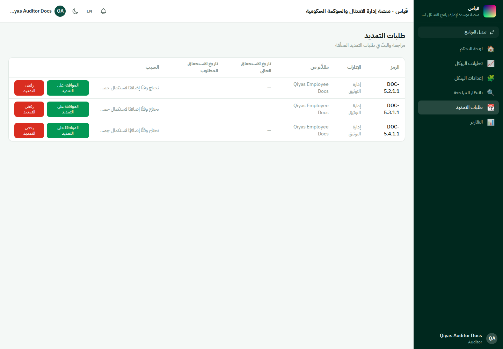

**شكل 50: قائمة طلبات التمديد المعلَّقة**

### إجراء: الموافقة على طلب تمديد

| الحقل | التفصيل |
|---|---|
| **اسم الإجراء** | الموافقة على التمديد |
| **الدور المسموح له** | المدقق (**هذا هو الإعداد الافتراضي الحالي وقابل للتغيير — يعتمد على الإعداد**)، المسؤول العام |
| **الهدف** | تمديد الموعد النهائي الفعلي للمتطلب رسميًا |
| **المتطلبات المسبقة** | الطلب بحالة «قيد الانتظار» |
| **خطوات التنفيذ** | 1) من قائمة طلبات التمديد، اضغط زر «موافقة» بجانب الطلب. 2) أدخل ملاحظات اختيارية. 3) أكِّد. |
| **النتيجة المتوقعة** | تظهر رسالة «تم تسجيل القرار»، ويُحدَّث تاريخ الاستحقاق الفعلي للمتطلب |
| **الحالة التالية** | معتمد |
| **التنبيه** | إشعار للموظف بنوع `extension_approved` |
| **ملاحظات** | **مدير الإدارة لا يملك هذه الصلاحية بالإعداد الحالي** — راجع القسم 35 |
| **الأخطاء المحتملة** | — |
| **الصور المرتبطة** | شكل 51، شكل 52 |

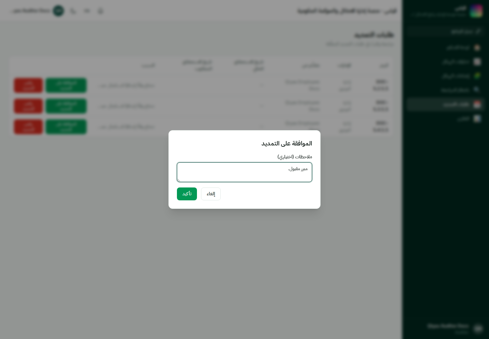

**شكل 51: نموذج الموافقة على طلب تمديد مع حقل الملاحظات**

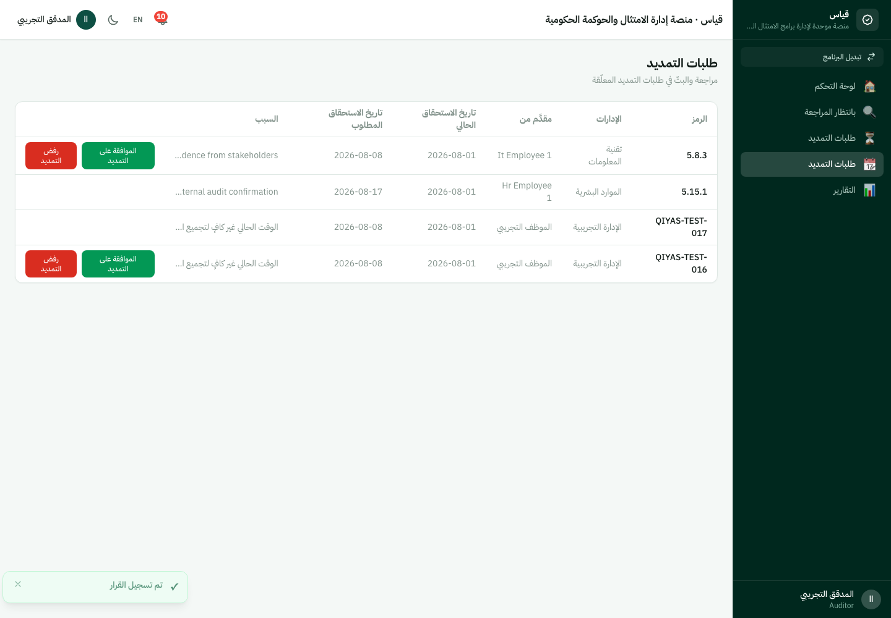

**شكل 52: رسالة تأكيد الموافقة على التمديد**

### إجراء: رفض طلب تمديد

| الحقل | التفصيل |
|---|---|
| **اسم الإجراء** | رفض التمديد |
| **الدور المسموح له** | المدقق (يعتمد على الإعداد)، المسؤول العام |
| **الهدف** | رفض طلب التمديد مع الإبقاء على الموعد النهائي الحالي |
| **المتطلبات المسبقة** | سبب الرفض إلزامي |
| **خطوات التنفيذ** | 1) اضغط زر «رفض» بجانب الطلب. 2) أدخل سبب الرفض. 3) أكِّد. |
| **النتيجة المتوقعة** | تظهر رسالة «تم تسجيل القرار» |
| **الحالة التالية** | مرفوض |
| **التنبيه** | إشعار للموظف بنوع `extension_rejected` |
| **ملاحظات** | — |
| **الأخطاء المحتملة** | ترك حقل السبب فارغًا |
| **الصور المرتبطة** | شكل 53، شكل 54 |

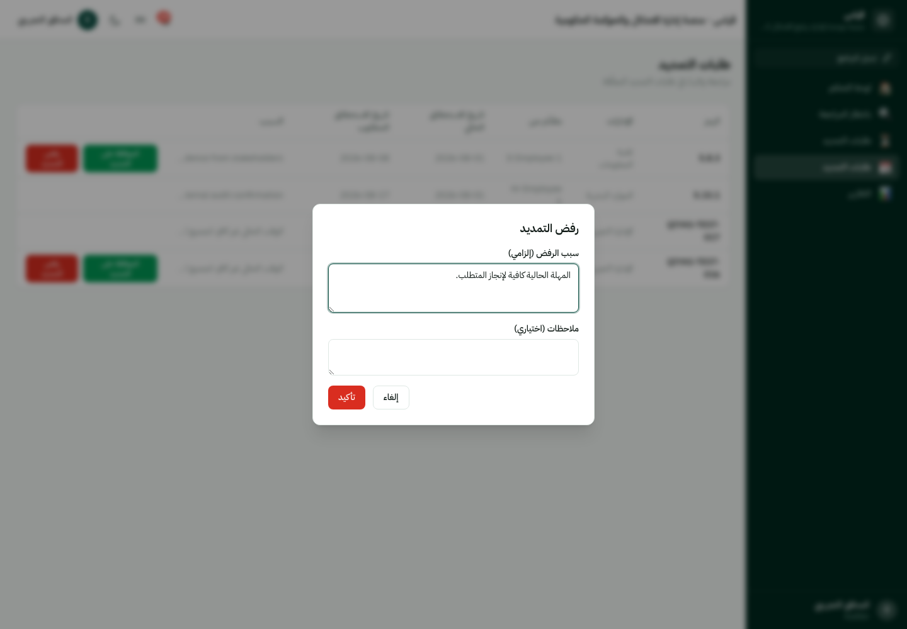

**شكل 53: نموذج رفض طلب التمديد مع حقل السبب الإلزامي**

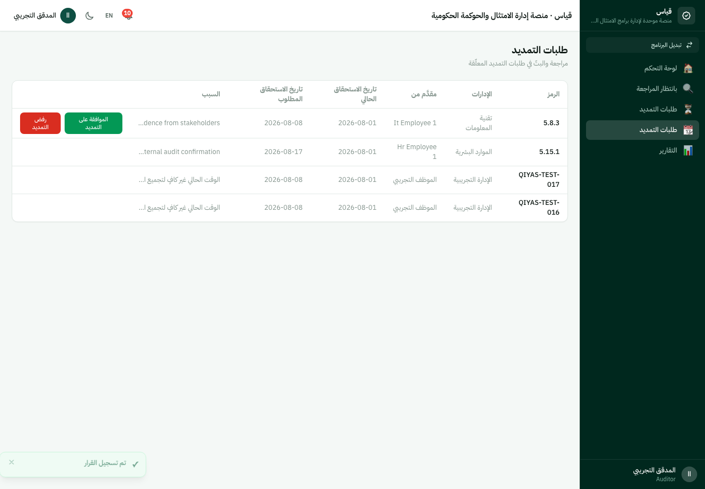

**شكل 54: رسالة تأكيد رفض طلب التمديد**

---

# 26. المسودات والإرسال

تمرّ كل عملية رفع دليل إثبات بمرحلتين منفصلتين دائمًا:

1. **مرحلة المسودة**: يمكن للموظف رفع ملف واحد أو أكثر، وإضافة تعليقات، وحذف ملف مرفوع بالخطأ، دون أن يظهر أي من ذلك لأي جهة مراجعة بعد. الحالة تبقى «مسودة».
2. **الإرسال الصريح**: يتطلب دائمًا إجراءً مستقلًا وواعيًا من الموظف (زر «إرسال للمراجعة») — لا يحدث الإرسال تلقائيًا لمجرد رفع ملف. يشترط الإرسال وجود ملف إثبات واحد على الأقل مرفق.

هذا الفصل بين الرفع والإرسال يمنح الموظف مساحة لتجهيز الأدلة على مراحل قبل تحويلها رسميًا لدورة المراجعة. راجع القسم 21 للخطوات التفصيلية الكاملة.

---

# 27. الرفض وإعادة الإرسال

هذه القاعدة الموحَّدة تنطبق على **كل** مرحلة رفض في سير عمل قياس، تم التحقق منها فعليًا من الكود المصدري لخدمة سير العمل (WorkflowService)، وهي ثابتة بصرف النظر عن هوية الدور الرافض:

> ### القاعدة الموحَّدة للرفض
>
> **1.** أي رفض — من مدير الإدارة، أو المدقق، أو مدير برنامج قياس في الاعتماد النهائي — **يُعيد الطلب دائمًا إلى الموظف مباشرة**، بحالة **«معاد للتعديل»**، وليس إلى المرحلة السابقة التي أحالت الطلب للرافض.
>
> **2.** عندما يُصحِّح الموظف الطلب ويعيد إرساله، **يبدأ الطلب مسار المراجعة من جديد بدءًا من مدير الإدارة دائمًا**، حتى لو كان الرافض الأصلي هو المدقق أو مدير البرنامج نفسه. لا يوجد مسار يُعيد الطلب مباشرة لنفس المرحلة التي رفضته.

**سبب الرفض إلزامي في جميع مراحل الرفض الثلاث** دون استثناء، ويظهر للموظف كشريط تنبيه بارز أعلى صفحة تفاصيل المتطلب حتى يُصحَّح (راجع شكل 39 في القسم 21).

يوضّح الجدول التالي حالة كل مرحلة مراجعة عند الرفض:

| مرحلة الرفض | نوع الإشعار للموظف | الحالة الناتجة |
|---|---|---|
| مدير الإدارة | `department_manager_rejected` | معاد للتعديل |
| المدقق | `auditor_rejected` | معاد للتعديل |
| الاعتماد النهائي (مدير البرنامج) | `program_manager_rejected` | معاد للتعديل |

---

# 28. التقارير

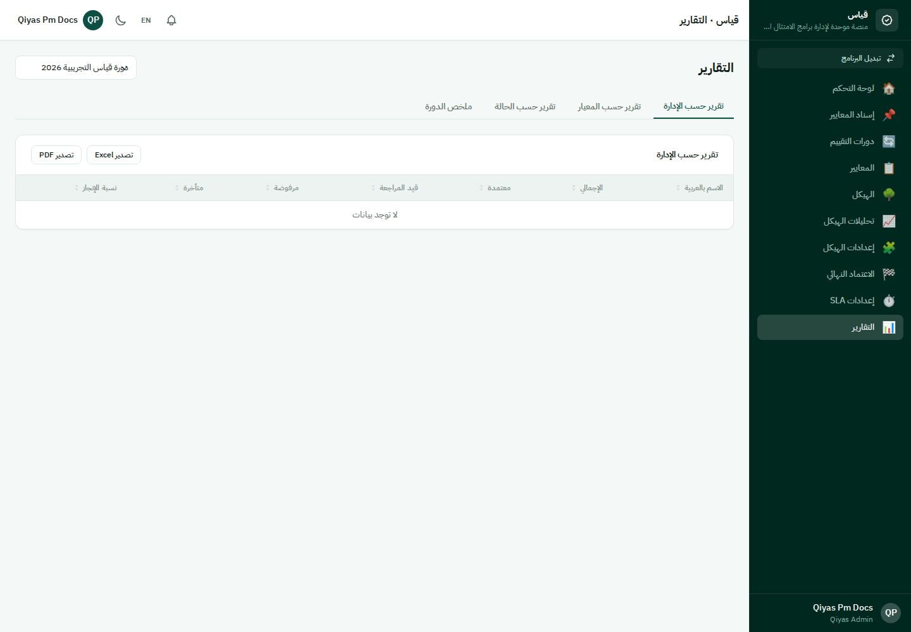

**شكل 55: تبويب «تقرير حسب الإدارة»**

### إجراء: عرض التقارير

| الحقل | التفصيل |
|---|---|
| **اسم الإجراء** | عرض/تصفية التقارير |
| **الدور المسموح له** | مدير برنامج قياس، المدقق، المشاهد التنفيذي (عرض فقط)، المسؤول العام |
| **الهدف** | متابعة مؤشرات الأداء والامتثال حسب الإدارة، أو المعيار، أو الحالة، أو ملخص الدورة |
| **المتطلبات المسبقة** | — |
| **خطوات التنفيذ** | 1) افتح «التقارير» من القائمة الجانبية. 2) اختر التبويب المطلوب (حسب الإدارة / حسب المعيار / حسب الحالة / ملخص الدورة). 3) استخدم عوامل التصفية المتاحة حسب الحاجة. |
| **النتيجة المتوقعة** | عرض جدول أو مؤشرات محدَّثة حسب الاختيار |
| **الحالة التالية** | — |
| **التنبيه** | — |
| **ملاحظات** | **مدير الإدارة والموظف لا يملكان صلاحية الوصول لهذه الصفحة إطلاقًا** — تم التحقق من رفض الخادم لهذا الطلب صراحة (403) حتى عند المحاولة المباشرة دون المرور بالواجهة |
| **الأخطاء المحتملة** | — |
| **الصور المرتبطة** | شكل 55، شكل 56، شكل 57، شكل 58 |

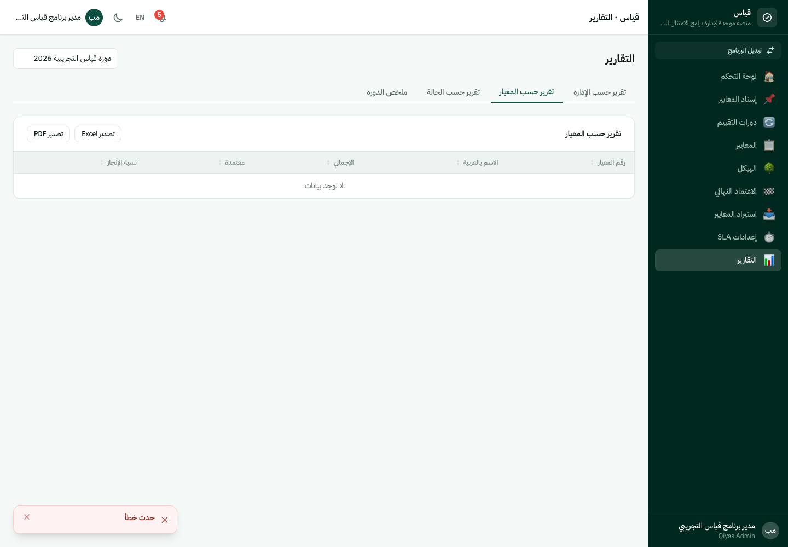

**شكل 56: تبويب «تقرير حسب المعيار»**

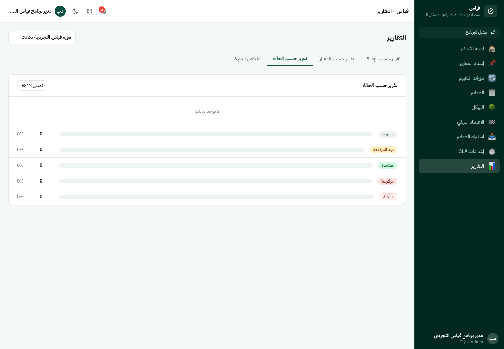

**شكل 57: تبويب «تقرير حسب الحالة»**

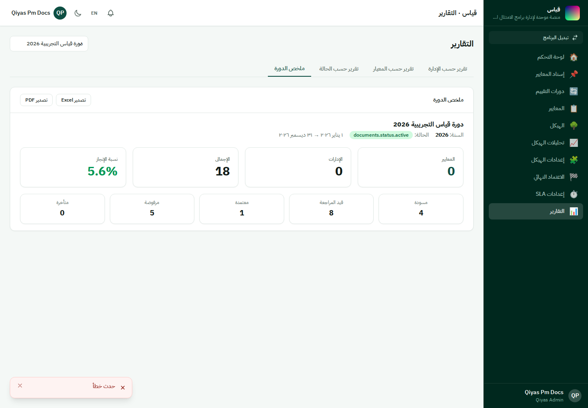

**شكل 58: تبويب «ملخص الدورة»**

### إجراء: تصدير تقرير (Excel / PDF)

| الحقل | التفصيل |
|---|---|
| **اسم الإجراء** | تصدير التقرير |
| **الدور المسموح له** | نفس أدوار عرض التقارير أعلاه |
| **الهدف** | الحصول على نسخة قابلة للتنزيل من التقرير الحالي |
| **المتطلبات المسبقة** | — |
| **خطوات التنفيذ** | 1) من داخل أي تبويب تقرير، اضغط زر التصدير المطلوب (Excel أو PDF). |
| **النتيجة المتوقعة** | تنزيل ملف يحتوي بيانات التقرير الظاهرة حاليًا |
| **الحالة التالية** | — |
| **التنبيه** | — |
| **ملاحظات** | — |
| **الأخطاء المحتملة** | — |
| **الصور المرتبطة** | — |

> **⚠️ ملاحظة توثيقية عن خلل تم اكتشافه وإصلاحه**: عند فحص هذا القسم أثناء إعداد هذا الدليل، تبيَّن أن استدعاء قائمة الدورات في شاشة التقارير (وخمس شاشات أخرى) كان يفتقد معامل البرنامج المطلوب، مما ينتج عنه طلبًا فاشلًا (404) ويترك حقل تصفية الدورة فارغًا بصمت دون أي رسالة خطأ ظاهرة للمستخدم. تم إصلاح هذا الخلل قبل التقاط لقطات هذا القسم، والتقارير أعلاه تعكس السلوك الصحيح بعد الإصلاح.

---

# 29. استيراد وتصدير Excel

يتيح النظام لمدير برنامج قياس استيراد مجموعة معايير دفعة واحدة عبر ملف Excel، بدلًا من إضافتها يدويًا واحدًا تلو الآخر.

### إجراء: تنزيل قالب الاستيراد

| الحقل | التفصيل |
|---|---|
| **اسم الإجراء** | تنزيل القالب |
| **الدور المسموح له** | مدير برنامج قياس، المسؤول العام |
| **الهدف** | الحصول على ملف Excel بالتنسيق والأعمدة الصحيحة المطلوبة للاستيراد |
| **المتطلبات المسبقة** | — |
| **خطوات التنفيذ** | 1) من صفحة «استيراد المعايير»، اضغط زر تنزيل القالب. |
| **النتيجة المتوقعة** | تنزيل ملف Excel فارغ بالأعمدة الصحيحة |
| **الحالة التالية** | — |
| **التنبيه** | — |
| **ملاحظات** | يجب استخدام هذا القالب تحديدًا؛ الاستيراد يتحقق من مطابقة الأعمدة والبرنامج والإصدار |
| **الأخطاء المحتملة** | — |
| **الصور المرتبطة** | — |

### إجراء: معاينة الاستيراد

| الحقل | التفصيل |
|---|---|
| **اسم الإجراء** | معاينة استيراد |
| **الدور المسموح له** | مدير برنامج قياس، المسؤول العام |
| **الهدف** | التحقق من صحة الملف قبل تنفيذ الاستيراد فعليًا |
| **المتطلبات المسبقة** | ملف مطابق للقالب وللبرنامج والإصدار المطلوبين |
| **خطوات التنفيذ** | 1) ارفع ملف Excel المُعبَّأ. 2) اضغط زر معاينة. |
| **النتيجة المتوقعة** | تقرير معاينة يوضّح الصفوف الصحيحة والأخطاء إن وُجدت |
| **الحالة التالية** | — |
| **التنبيه** | — |
| **ملاحظات** | — |
| **الأخطاء المحتملة** | ملف بتنسيق غير مطابق للقالب، أو بيانات غير مكتملة في بعض الصفوف |
| **الصور المرتبطة** | — |

### إجراء: تأكيد الاستيراد

| الحقل | التفصيل |
|---|---|
| **اسم الإجراء** | تأكيد الاستيراد |
| **الدور المسموح له** | مدير برنامج قياس، المسؤول العام |
| **الهدف** | تنفيذ الاستيراد الفعلي بعد التأكد من صحة الملف |
| **المتطلبات المسبقة** | صفر أخطاء في تقرير المعاينة |
| **خطوات التنفيذ** | 1) بعد معاينة ناجحة بدون أخطاء، اضغط زر «تأكيد الاستيراد». |
| **النتيجة المتوقعة** | إنشاء أو تحديث المعايير الواردة في الملف |
| **الحالة التالية** | — |
| **التنبيه** | — |
| **ملاحظات** | لا يمكن التأكيد إن كانت المعاينة تحتوي على أي خطأ |
| **الأخطاء المحتملة** | — |
| **الصور المرتبطة** | — |

---

# 30. دليل الحالات

تم التحقق من قوائم الحالات التالية مباشرة من نماذج البيانات وشارات الحالة الفعلية في الواجهة، وهي القوائم الكاملة والوحيدة المستخدمة في سير عمل قياس الحالي:

## 30.1 حالات دورة التقييم

| الحالة كما تظهر في الواجهة | المعنى |
|---|---|
| **مسودة** | الدورة أُنشئت ولم تُفعَّل بعد؛ لا يمكن إسناد معايير عليها |
| **نشطة** | الدورة مفعَّلة، ويمكن إضافة معايير وإسنادها ومتابعة المراجعات |
| **مغلقة** | انتهت الدورة؛ لا يمكن إضافة أو تعديل معايير جديدة |
| **مؤرشفة** | الدورة مؤرشفة نهائيًا لأغراض الأرشفة والرجوع التاريخي فقط |

## 30.2 حالات الطلب / التقديم (Submission)

| الحالة كما تظهر في الواجهة | المعنى |
|---|---|
| **مسودة** | الموظف يُجهّز الأدلة ولم يُرسل الطلب بعد |
| **بانتظار مدير الإدارة** | تم الإرسال، بانتظار مراجعة مدير الإدارة |
| **بانتظار المدقق** | وافق مدير الإدارة، بانتظار مراجعة المدقق |
| **بانتظار الاعتماد النهائي** | وافق المدقق، بانتظار اعتماد مدير برنامج قياس النهائي |
| **معاد للتعديل** | رُفض الطلب من أي مرحلة، وعاد للموظف للتصحيح |
| **معتمد** | اجتاز الطلب جميع مراحل المراجعة، واعتُمد نهائيًا |

## 30.3 حالات طلب التمديد

| الحالة كما تظهر في الواجهة | المعنى |
|---|---|
| **قيد الانتظار** | طلب التمديد أُرسل، بانتظار البتّ فيه |
| **معتمد** | تمت الموافقة على التمديد، وتحدَّث الموعد النهائي |
| **مرفوض** | رُفض طلب التمديد، والموعد النهائي الحالي لم يتغيَّر |

---

# 31. قاموس الحقول والأزرار

| المصطلح في الواجهة | المعنى |
|---|---|
| دورة جديدة | زر إنشاء دورة تقييم جديدة |
| تفعيل الدورة | زر نقل الدورة من «مسودة» إلى «نشطة» |
| إغلاق الدورة | زر نقل الدورة النشطة إلى «مغلقة» |
| أرشفة الدورة | زر نقل الدورة المغلقة إلى «مؤرشفة» |
| إسناد | زر إسناد معيار لإدارة |
| إعادة الإسناد | زر نقل إسناد معيار من إدارة لأخرى |
| سبب إعادة الإسناد (إلزامي) | حقل نصي إلزامي عند إعادة الإسناد |
| متطلباتي | رابط قائمة المتطلبات المسندة للموظف/إدارته |
| موافقة | زر اعتماد الطلب في أي مرحلة مراجعة |
| رفض | زر إعادة الطلب للموظف مع سبب إلزامي |
| ملاحظات (اختياري) | حقل نصي اختياري يُرفق مع قرار الموافقة |
| طلب تمديد | زر فتح نموذج طلب تمديد الموعد النهائي |
| بانتظار المراجعة | تسمية رابط قائمة مراجعة المدقق في القائمة الجانبية |
| الاعتماد النهائي | تسمية رابط قائمة مراجعة مدير برنامج قياس (المرحلة الأخيرة) |
| مراجعة مدير الإدارة | تسمية رابط قائمة مراجعة مدير الإدارة |
| تعليم الكل كمقروء | زر تصفير عداد الإشعارات غير المقروءة |
| نسبة الإنجاز | مؤشر نسبة المتطلبات المعتمدة من إجمالي المتطلبات المسندة ضمن الدورة الحالية |

---

# 32. رسائل التحقق والأخطاء الشائعة

| الموقف | السبب المحتمل | الإجراء المقترح |
|---|---|---|
| رفض تسجيل الدخول | اسم مستخدم أو كلمة مرور غير صحيحة، أو حساب غير نشط | تأكد من صحة البيانات، وتواصل مع مسؤول النظام إن استمرت المشكلة |
| تعذّر حفظ نموذج دورة/معيار جديد | حقل إلزامي فارغ، أو تاريخ نهاية أسبق من تاريخ البداية | راجع الحقول المميَّزة وأعد المحاولة |
| عدم ظهور زر «تفعيل الدورة» | الدورة ليست بحالة «مسودة» | لا حاجة لأي إجراء؛ الزر يظهر فقط عندما يكون الإجراء ممكنًا |
| تعذّر تأكيد الرفض | حقل سبب الرفض فارغ | سبب الرفض إلزامي في جميع مراحل المراجعة الثلاث دون استثناء |
| تعذّر إرسال المتطلب للمراجعة | لا يوجد أي ملف إثبات مرفق | ارفع ملفًا واحدًا على الأقل قبل الإرسال |
| صفحة فارغة أو رسالة رفض عند فتح رابط مباشرة | الدور الحالي لا يملك صلاحية الوصول لهذه الصفحة | هذا سلوك متوقع ومقصود؛ راجع القسم 35 لمعرفة الدور المخوَّل |
| زر «تعليم الكل كمقروء» معطَّل | لا توجد إشعارات غير مقروءة حاليًا | لا حاجة لأي إجراء |

---

# 33. الأسئلة الشائعة

**س: لماذا لا تظهر لي بيانات فعلية في لوحة التحكم رغم وجود متطلبات كثيرة في البرنامج؟**
ج: إذا كنت مدير برنامج قياس، فهذا سلوك معروف ومؤكَّد (راجع القسم 16) — استخدم الشاشات الوظيفية المباشرة (دورات التقييم، إسناد المعايير، الاعتماد النهائي، التقارير) بدلًا من الاعتماد على لوحة التحكم لمتابعة عملك.

**س: رفضتُ طلبًا كمدقق، فلماذا عاد إلى الموظف مباشرة بدلًا من العودة إليّ لاحقًا بعد التصحيح؟**
ج: هذا هو التصميم المقصود لسير العمل. أي رفض يعيد الطلب للموظف، وإعادة الإرسال تبدأ دائمًا من مدير الإدارة من جديد، بصرف النظر عن هوية الرافض (راجع القسم 27).

**س: لماذا لا أستطيع رؤية المتطلبات التي اعتُمدت نهائيًا في قائمة «متطلباتي»؟**
ج: هذا سلوك مؤكَّد من التطبيق؛ المتطلبات المعتمدة نهائيًا تختفي من هذه القائمة، ولا توجد حاليًا صفحة مخصصة لعرض السجل التاريخي المعتمد (راجع القسم 21).

**س: من الذي يبتّ في طلبات التمديد؟**
ج: المدقق بالإعداد الافتراضي الحالي، إلا أن هذا الدور قابل للتغيير من قِبل الإدارة عبر الإعداد المخصص لذلك (راجع القسم 35). مدير الإدارة لا يملك هذه الصلاحية بالإعداد الحالي.

**س: هل يمكن لمستخدم واحد أن يجمع بين أكثر من دور؟**
ج: نعم، تقنيًا يمكن أن يحمل المستخدم أكثر من دور برنامج ضمن قياس في آن واحد، وتُطبَّق صلاحيات كل دور من أدواره دون تعارض (راجع القسم 8).

---

# 34. اعتبارات إمكانية الوصول

- تدعم الواجهة اتجاه الكتابة من اليمين إلى اليسار (RTL) بشكل كامل عند اختيار اللغة العربية.
- تتوفر إمكانية التبديل الفوري بين اللغة العربية والإنجليزية عبر زر مخصص أعلى كل صفحة.
- يتوفر وضع عرض داكن (Dark Mode) قابل للتبديل من نفس الشريط العلوي.
- جميع نماذج الإدخال الأساسية تحمل تسميات (Labels) واضحة مرتبطة بحقولها.

---

# 35. جدول الصلاحيات المختصر

الجدول الكامل التفصيلي متوفر في ملف منفصل قابل للفرز والتصفية: **`role-permission-matrix.xlsx`** (يتضمن ورقة «مفتاح الرموز» توضّح معنى كل قيمة). فيما يلي ملخص مختصر لأبرز الوظائف:

| الوظيفة | مدير برنامج قياس | مدير الإدارة | المدقق | الموظف | المشاهد التنفيذي |
|---|---|---|---|---|---|
| إدارة دورات التقييم | مسموح ضمن قياس | غير مسموح | غير مسموح | غير مسموح | غير مسموح |
| إسناد المعايير | مسموح ضمن قياس | غير مسموح | غير مسموح | غير مسموح | غير مسموح |
| رفع الأدلة وإرسالها | غير مسموح | غير مسموح | غير مسموح | مسموح ضمن الإدارة | غير مسموح |
| مراجعة مدير الإدارة | غير مسموح | مسموح ضمن الإدارة | غير مسموح | غير مسموح | غير مسموح |
| مراجعة المدقق | غير مسموح | غير مسموح | مسموح ضمن قياس | غير مسموح | غير مسموح |
| البتّ في طلبات التمديد | غير مسموح | غير مسموح | يعتمد على الإعداد | غير مسموح | غير مسموح |
| الاعتماد النهائي | مسموح ضمن قياس | غير مسموح | غير مسموح | غير مسموح | غير مسموح |
| عرض التقارير | مسموح ضمن قياس | غير مسموح | مسموح ضمن قياس | غير مسموح | عرض فقط |
| إعدادات SLA | مسموح ضمن قياس | غير مسموح | غير مسموح | غير مسموح | غير مسموح |

> **تنبيه مهم**: كل قيمة «غير مسموح» في هذا الدليل تم التحقق منها **على مستويين معًا**: إخفاء عنصر التحكم في الواجهة، **و**رفض الخادم صراحة (401/403) عند محاولة الوصول المباشر لنقطة النهاية دون المرور بالواجهة. هذا يعني أن الحماية فعلية وليست شكلية فقط (راجع `verification-report.md` للتفاصيل الكاملة لكل اختبار).

---

**نهاية دليل المستخدم — برنامج قياس**
